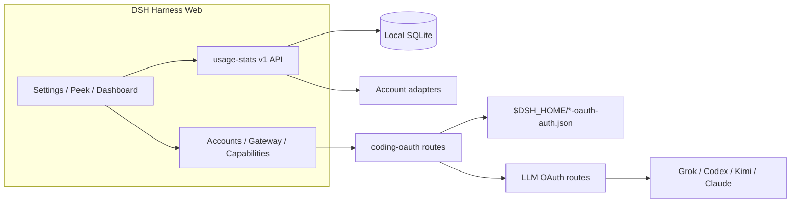

<!-- banner -->
<div align="center">

# dsh-hub-oauth-gateway

**v1.7.2** · früher `dsh-usage-stats`

**Local-first Usage Center für [DeepSeek Harness](https://github.com/deepseek-ai/dsh) Web.** Tokens, geschätzte Kosten, Kontostände, Abo-Kontingente, Trends, Prognosen, Alerts und Exporte — plus Coding-Abo-OAuth (Grok Build, Codex, Kimi Code, Claude Code), optionales Loopback-API-Gateway und opt-in lokale Auth-/Usage-Überwachung. **Keine Tokens im Chat einfügen.**

[](https://github.com/lninghaha/dsh-hub-oauth-gateway/actions/workflows/ci.yml)
[](LICENSE)
[](.github/CONTRIBUTING.md)

*[English](README.md) · [中文版](README.zh-CN.md) · [日本語](README.ja.md) · [한국어](README.ko.md) · [Português (BR)](README.pt-BR.md) · [Español](README.es.md) · [Français](README.fr.md) · [Deutsch](README.de.md) · [Русский](README.ru.md)*

</div>

---

## Namensänderung

Zuerst als **`dsh-usage-stats`** veröffentlicht. Paket und Repository heißen jetzt **`dsh-hub-oauth-gateway`** (ab **1.1.0**). Entfernen Sie jeden alten Eintrag vor der Neuinstallation. Lokale Datendateien und die interne Cordis-Plugin-id bleiben gleich, historische Nutzung bleibt erhalten.

| | Verwenden Sie | Funktioniert weiter / unverändert |
|---|---|---|
| npm (empfohlen) | `dsh plugin --profile web add dsh-hub-oauth-gateway` | Alter npm-Name wird nicht mehr aktualisiert |
| GitHub / Entwicklung | [`dsh-hub-oauth-gateway`](https://github.com/lninghaha/dsh-hub-oauth-gateway) | — |
| Cordis-Plugin-id | `usage-stats` | unverändert |
| SQLite-Datenbank | `${DSH_HOME}/storages/usage-stats-v1.sqlite` | unverändert |
| CLI | `dsh-coding-oauth` | `dsh-grok-build` (Alias) |

Release-Historie in [`CHANGELOG.md`](CHANGELOG.md).

## Funktionen

- **Quick Peek + Full Dashboard** — schwebendes HUD (oder Sidebar-Button); Tabs overview / trends / accounts / details / local; today / 7d / 30d / month; Vorperiode vergleichen; manuelles Refresh.
- **Tab-Einstellungen** — Display / Accounts / Gateway / Capabilities / Providers / Fees unter Settings → Usage Center.
- **Presets und Module** — Minimal, Quota, Cost, Analyst; benutzerdefinierte Modulreihenfolge; Dichte, Motion, Provider-Aliase und Farben.
- **Aktivitäts-Heatmap** — 370-Tage-Kalender + Streak in konfigurierter Zeitzone.
- **Lokale Historie** — projiziert DSH-Nutzung nach `(session, turn, step)` in SQLite; spätere Samples ersetzen, nie doppelt zählen.
- **Kostenschätzungen** — nutzereigene Preise pro Million mit Coverage-Ratio; fehlende Preise werden nie als kostenlos behandelt.
- **Abo-Gebühren-Ledger** — lokale Abo-/Aufladekosten; Payback-Multiples bei gleicher Währung.
- **Trends und Prognosen** — Stunden/Tag/Woche/Monat-Buckets; begrenzte lineare Extrapolation als eigene Serie.
- **Konto- und Kontingent-Adapter** — Salden, Fenster, Reset-Zeiten, stale/last-success, Soft-Alerts (keine Hard-Blocks, keine ausgehenden Benachrichtigungen).
- **CSV / JSON-Export** — gefilterte, tägliche oder Bundle-Layouts; optionale Session-Redaktion; Spreadsheet-Injection-Abwehr.
- **Coding-Abo-OAuth** — Grok Build, Codex, Kimi Code, Claude Code via device code / Browser / PKCE-Einfügen; Modelle als `(OAuth)`; einseitiger CLI-Credential-Pull.
- **Optionales Loopback-API-Gateway** — standardmäßig aus OpenAI/Anthropic-kompatibler Server für eigene Tools.
- **Optionale Capabilities** — Codex search / images / usage / Fast und Grok Imagine standardmäßig aus; Live-Anwendung.
- **Opt-in lokaler Monitor** — read-only CLI-Auth-Snapshots und Cross-Tool-Token-Scans (nie Gesprächsinhalt).
- **Zweisprachige UI** — Chinesisch und Englisch über DSH-Locale-Services.

Produktrecherche: [`docs/research/usage-analytics-landscape.md`](docs/research/usage-analytics-landscape.md). Architektur: [`docs/02-architecture.md`](docs/02-architecture.md).

## Screenshots

Aufgenommen in DeepSeek Harness Web mit installiertem Plugin (leere lokale Historie ist bei einem frischen isolierten Profile normal).

<p align="center">
  
  <br />
  <em>Schwebendes HUD — heutige Metrik und Multi-Account-Quota-Chips</em>
</p>

<p align="center">
  
  <br />
  <em>Quick Peek — nur lokale KPIs, mit Sprung zum vollständigen Dashboard</em>
</p>

<p align="center">
  
  <br />
  <em>Vollständiges Dashboard — Bereiche, Tabs, Aktualisieren und CSV-/JSON-Export</em>
</p>

<p align="center">
  
  <br />
  <em>Einstellungen → Usage Center — Anzeige / Konten / Gateway / Capabilities / Anbieter / Gebühren</em>
</p>

## Probleme, die dieses Plugin löst

| Sie suchten / sahen | Was wirklich kaputt war | Was dieses Plugin tut |
|---|---|---|
| Nutzung / Kosten / Kontingent über CLIs und Provider verstreut | Keine einheitliche lokale Historie oder Coverage-bewusste Kostenansicht | SQLite-Projektion + Preisregeln + Konto-Adapter im Usage Center |
| SuperGrok / ChatGPT Plus / Kimi Code / Claude Pro in DSH ohne weitere API-Rechnung | Built-in-Routen oft Pay-as-you-go API keys | Lokale OAuth-Routen koexistieren mit bestehenden API-key-Providern |
| `本轮运行失败` **API key is invalid** / `AUTH` mitten im Turn | GUI mappt jedes `AUTH` auf dieses Banner; OAuth access tokens laufen ab | Proaktives Refresh und AUTH-bewusster Retry auf Coding-OAuth-Routen |
| OpenAI/Anthropic-kompatible Tools gegen Abo-Sessions | Keine sichere lokale Brücke | Opt-in Loopback-Gateway (kein öffentliches Relay) |
| Token-Monitor-artiger CLI-Status ohne Secrets einfügen | Manuelles Datei-Wühlen oder Chat-Einfügen | Opt-in localMonitor / localUsage auf gehärteten Allowlist-Pfaden |

## Schnellstart

```bash
# 1. install the current npm release into the web profile
dsh plugin --profile web add dsh-hub-oauth-gateway

# 2. restart the resident dsh web service (operator chooses when)
systemctl --user restart dsh-web.service
# or: dsh-web restart
```

Dann **Settings → Usage Center** öffnen. Für Accounts / Gateway / Capabilities bei Bedarf anmelden oder Schalter aktivieren. Vollständige Installationsoptionen (npx-Installer, GitHub-tarball, Proxy) in [`docs/01-install.md`](docs/01-install.md).

## Inhaltsverzeichnis

- [Namensänderung](#namensänderung)
- [Funktionen](#funktionen)
- [Screenshots](#screenshots)
- [Probleme, die dieses Plugin löst](#probleme-die-dieses-plugin-löst)
- [Schnellstart](#schnellstart)
- [Anforderungen](#anforderungen)
- [Installation](#installation)
- [Nutzung](#nutzung)
- [Einstellungen](#einstellungen)
- [Coding OAuth](#coding-oauth)
- [Lokales API-Gateway](#lokales-api-gateway)
- [Optionale Capabilities](#optionale-capabilities)
- [Runtime-Konfiguration](#runtime-konfiguration)
- [Credentials](#credentials)
- [Daten und Migration](#daten-und-migration)
- [Datenschutz und Sicherheit](#datenschutz-und-sicherheit)
- [Architektur](#architektur)
- [Dokumentation](#dokumentation)
- [Mitwirken](#mitwirken)
- [Lizenz](#lizenz)

## Anforderungen

- DeepSeek Harness Web, verifiziert mit `@deepseek-ai/dsh 0.1.0-rc.6`
- Node.js `^22.19.0 || >=24.0.0`
- Loopback DSH-Web-Backend; kontrollierter lokaler HTTPS-Reverse-Proxy zu authentifiziertem Privatnetz OK. Plugin-API nicht allein exponieren oder unauthentifiziert ins öffentliche Internet stellen.

## Installation

```bash
dsh plugin --profile web add dsh-hub-oauth-gateway
dsh plugin --profile web update dsh-hub-oauth-gateway
dsh plugin --profile web remove dsh-hub-oauth-gateway
```

Kompatible Installation ohne Plugin-Manager: `npx --yes dsh-hub-oauth-gateway-install`. GitHub `/path/to/*.tgz` und Entwicklungspfad-Installation in [`docs/01-install.md`](docs/01-install.md). Nach Installation Web selbst neu starten (`dsh-web restart` oder `systemctl --user restart dsh-web.service`), dann `http://127.0.0.1:3080` aktualisieren.

## Nutzung

1. Quick Peek über schwebendes HUD (oder Sidebar-Button unter **Settings → Display → entry mode**) öffnen. Einstellungen verlinken auch Peek / Full Dashboard.
2. Im Full Dashboard overview / trends / accounts / details / local wechseln; range, metric und provider/model-Dimensionen wählen.
3. Refresh-Button für sofortige Projektion und Konto-Refresh. Gewöhnliches GET liest nur lokale Snapshots.
4. Display / Accounts / Gateway / Capabilities / Providers / Fees unter **Settings → Usage Center** konfigurieren.
5. Kosten sind immer Schätzungen — Coverage-Prozent beachten; ungepreiste Tokens sind nicht kostenlos.

CLI: `dsh-coding-oauth login [--pkce] | import | status | logout` (`dsh-grok-build` ist Alias).

## Einstellungen

**Settings → Usage Center** hat sechs Top-Tabs: **Display**, **Accounts**, **Gateway**, **Capabilities**, **Providers** und **Fees**. Angemeldete Provider-Karten eingeklappt bis expandiert. API Key / Copilot device auth unter Providers.

## Coding OAuth

Tab **Accounts**: bei Grok Build, Codex, Kimi Code oder Claude Code anmelden (device code bevorzugt auf Remote/Headless; Browser/PKCE kann Code oder vollständige Redirect-URL einfügen). Authentifizierte Modelle erscheinen im Selector mit `(OAuth)`.

Allowlist-offizielle CLI-OAuth-Dateien werden read-only entdeckt. Sync ist expliziter einseitiger **Pull** (discover → preview → confirm), nie Auto-Import und schreibt nie offizielle CLI-Dateien.

## Lokales API-Gateway

Standard **aus**. Wenn aktiv, bedient isolierter `node:http`-Listener (nicht DSH-Web-Port) `GET /healthz`, `GET /v1/models`, `POST /v1/chat/completions`, `POST /v1/responses` und `POST /v1/messages` auf Loopback, nutzt angemeldete OAuth-Sessions. bind nur YAML; Nicht-Loopback-bind erfordert Bearer key. Kein Remote-Relay. Details: [`docs/01-install.md`](docs/01-install.md).

## Optionale Capabilities

Sieben Schalter standard **aus**, Anwendung **live**: `codexSearch`, `codexImages`, `codexImageEdits`, `codexUsage`, `codexFast`, `grokImagineImage`, `grokImagineVideo`. Codex Fast / private Endpoints und Grok Imagine bleiben fail-closed bis aktiviert. Siehe [`docs/01-install.md`](docs/01-install.md) und [`docs/03-configuration.md`](docs/03-configuration.md).

## Runtime-Konfiguration

`config` unter bestehendem Cordis-Eintrag mergen — keinen zweiten Eintrag hinzufügen:

```yaml
# ~/.dsh/profiles/web/cordis.patch.yml
- insert:
    - id: usage-stats
      name: dsh-hub-oauth-gateway
      config:
        refresh:
          usageSeconds: 30
          accountMinutes: 5
          accountConcurrency: 3
          timeoutMs: 15000
        retention:
          usageDays: 730
          accountSnapshotDays: 180
          preserveDeletedSessions: true
        pricing:
          baseCurrency: USD
        accounts:
          monitors: {}
        oauthDevice:
          copilotClientId: YOUR_PUBLIC_OAUTH_CLIENT_ID
        codingOAuth:
          enabled: true
        localMonitor:
          enabled: false
        localUsage:
          enabled: false
          intervalMinutes: 30
```

Vollständige Feldreferenz, Monitors, Proxy und Pricing-Import: [`docs/03-configuration.md`](docs/03-configuration.md) und [`docs/01-install.md`](docs/01-install.md). Legacy-Root `config.monitors` mappt auf `config.accounts.monitors` (nicht beides setzen).

## Credentials

- Über DSH credential seam gespeichert; Browser erhält nur `configured` / `source` / `writable`-Metadaten — nie Werte.
- Lokaler CLI-Import (Claude, Codex, Gemini, Grok, Amp) protokolliert nie absolute Pfade.
- Copilot device flow hält device code serverseitig; Browser nur zufällige flow ID. Eigenen public OAuth client ID vor Aktivierung konfigurieren.
- Coding-OAuth-Dateien: `$DSH_HOME/.grok-build-auth.json` und andere `*-oauth-auth.json` (`0600`, atomares Schreiben). **Kein HTTP-Status, Log oder UI darf einen Token zurückgeben.**

## Daten und Migration

```text
${DSH_HOME:-~/.dsh}/storages/usage-stats-v1.sqlite
```

Verzeichnis `0700`, Hauptdatei `0600`, WAL. Standard-Retention: 730 Tage usage facts, 180 Tage Konto-Snapshots. Erststart-Migration und Rollback-Hinweise: [`docs/04-migration-v1.md`](docs/04-migration-v1.md).

## Datenschutz und Sicherheit

- Loopback peer + Loopback Host; JSON-Schreibkörper; Same-Origin / forwarded-host-Regeln für Reverse Proxies (`x-dsh-hub-oauth-gateway: 1`).
- Gewöhnliches GET nur lokal; credential-bearbeitendes Refresh ist explizites POST oder geplant.
- Monitors: HTTPS standardmäßig, keine URL-eingebetteten Credentials, manuelle Redirects, Größenlimits, DNS pinning vor Connect.
- SQLite schließt Credentials, Prompts, Responses, cwd und rohe Provider-Payloads aus.
- Analytics und Schätzungen sind keine Rechnungen. Nur Konten und Endpoints abfragen, die Sie besitzen oder nutzen dürfen.

Bedrohungsmodell und Meldung: [`.github/SECURITY.md`](.github/SECURITY.md).

## Architektur



Details: [`docs/02-architecture.md`](docs/02-architecture.md) · [中文](docs/02-architecture.zh-CN.md). OAuth-Attribution: [`docs/oauth-provenance.md`](docs/oauth-provenance.md).

## Dokumentation

| Doc | Zweck |
|---|---|
| [`docs/01-install.md`](docs/01-install.md) | Installation, Proxy, Gateway, Capabilities, Troubleshooting |
| [`CHANGELOG.md`](CHANGELOG.md) | Release-Historie |
| [`docs/00-project-rules.md`](docs/00-project-rules.md) | Veröffentlichungsschichten, Versionierung, Release-Loop |
| [`docs/02-architecture.md`](docs/02-architecture.md) | Interne Architektur · [中文](docs/02-architecture.zh-CN.md) |
| [`docs/03-configuration.md`](docs/03-configuration.md) | Runtime-Konfigurationsreferenz |
| [`docs/04-migration-v1.md`](docs/04-migration-v1.md) | 1.0-Datenmigration |
| [`.github/CONTRIBUTING.md`](.github/CONTRIBUTING.md) | Mitwirkungsleitfaden |
| [`.github/SECURITY.md`](.github/SECURITY.md) | Sicherheitsrichtlinie |

## Mitwirken

In Cursor Cloud / Cloud-Workspace dieses Repos mit deklariertem Node.js und pnpm verifizieren (Docker sandbox optional, nicht erforderlich). Isoliertes `DSH_HOME` für DSH-Smoke-Tests. Siehe [`.github/CONTRIBUTING.md`](.github/CONTRIBUTING.md). Secrets, Prompts und persönliche Pfade aus Issues, PRs, Screenshots und Logs fernhalten.

Fehlt Ihre Sprache in der Umschaltzeile, öffnen Sie einen PR mit README-Übersetzung.

## Lizenz

[MIT](LICENSE) · siehe [NOTICE](NOTICE). Unabhängiges Community-Projekt; kein Vendor-Endorsement impliziert. Coding-OAuth-Teile behalten Apache-2.0-Attribution wo erforderlich (`LICENSES/Apache-2.0.txt`).
