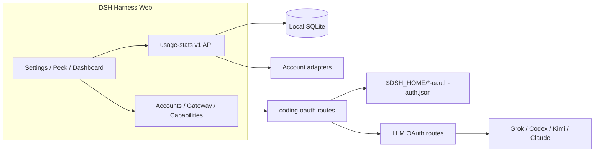

<!-- banner -->
<div align="center">

# dsh-hub-oauth-gateway

**v1.11.1** · anteriormente `dsh-usage-stats`

**Centro de uso local-first para [DeepSeek Harness](https://github.com/deepseek-ai/dsh) Web.** Tokens, coste estimado, saldos de cuenta, cuotas de suscripción, tendencias, previsiones, alertas y exportaciones — más OAuth de suscripciones de coding (Grok Build, Codex, Kimi Code, Claude Code), una puerta de enlace API loopback opcional y monitorización local opt-in de auth/uso. **No pegues tokens en el chat.**

[](https://github.com/lninghaha/dsh-hub-oauth-gateway/actions/workflows/ci.yml)
[](LICENSE)
[](.github/CONTRIBUTING.md)

*[English](README.md) · [中文版](README.zh-CN.md) · [日本語](README.ja.md) · [한국어](README.ko.md) · [Português (BR)](README.pt-BR.md) · [Español](README.es.md) · [Français](README.fr.md) · [Deutsch](README.de.md) · [Русский](README.ru.md)*

</div>

---

> **Upgrade / 升级：** Follow the versioned steps in [`docs/01-install.md`](docs/01-install.md). Hub `1.11.1` and Subscription `0.6.4` share the verified DSH `0.1.1-rc.2` contract and pin `dsh-coding-oauth-core@0.1.1` with `undici@7.29.0`. Keep profile, configuration, and credential files, update both plugins in the same Web profile, then restart the existing DSH Web process once.

---

## Cambio de nombre

Publicado inicialmente como **`dsh-usage-stats`**. El paquete y el repositorio son ahora **`dsh-hub-oauth-gateway`** (desde **1.1.0**). Elimina cualquier entrada antigua antes de reinstalar. Los archivos de datos locales y el id interno del plugin Cordis siguen iguales, preservando el historial de uso.

| | Usa esto | Sigue funcionando / sin cambios |
|---|---|---|
| npm (recomendado) | `dsh plugin --profile web add dsh-hub-oauth-gateway` | El nombre npm antiguo ya no se actualiza |
| GitHub / desarrollo | [`dsh-hub-oauth-gateway`](https://github.com/lninghaha/dsh-hub-oauth-gateway) | — |
| id del plugin Cordis | `usage-stats` | sin cambios |
| base de datos SQLite | `${DSH_HOME}/storages/usage-stats-v1.sqlite` | sin cambios |
| CLI | `dsh-coding-oauth` | `dsh-grok-build` (alias) |

Historial de releases en [`CHANGELOG.md`](CHANGELOG.md).

## Funciones

- **Quick Peek + Full Dashboard** — HUD flotante (o botón en la barra lateral); pestañas overview / trends / accounts / details / local; today / 7d / 30d / month; comparar periodo anterior; actualización manual.
- **Ajustes por pestañas** — Display / Accounts / Gateway / Capabilities / Providers / Fees en Settings → Usage Center.
- **Presets y módulos** — Minimal, Quota, Cost, Analyst; orden personalizado de módulos; densidad, motion, alias y colores de providers.
- **Mapa de calor de actividad** — calendario de 370 días + streak en la zona horaria configurada.
- **Historial local** — proyecta uso de DSH en SQLite por `(session, turn, step)`; muestras posteriores reemplazan, nunca cuentan doble.
- **Estimaciones de coste** — precios por millón definidos por el usuario con ratio de cobertura; precios ausentes nunca se tratan como gratis.
- **Libro de tarifas de suscripción** — costes locales de suscripción/recarga; múltiplos de payback cuando las monedas coinciden.
- **Tendencias y previsiones** — buckets hora/día/semana/mes; extrapolación lineal acotada como serie distinta.
- **Adaptadores de cuenta y cuota** — saldos, ventanas, horas de reset, stale/last-success, alertas suaves (sin bloqueos duros, sin notificación externa).
- **Exportación CSV / JSON** — diseños filtrados, diarios o bundle; redacción opcional de sesión; defensa contra inyección en hojas de cálculo.
- **Coding-subscription OAuth** — Grok Build, Codex, Kimi Code, Claude Code via device code / browser / PKCE paste; optional GitHub Copilot LLM route when `oauthDevice.copilotClientId` is set; multi-account store (max 8) with optional `codingOAuth.pool` (`off` | `priority` | `quota_aware`); Claude Code import via **Import Claude Code** (macOS Keychain or file fallback; preview → commit; overwrite still needs confirm); models appear as `(OAuth)`; one-way CLI credential Pull.
- **Puerta de enlace API loopback opcional** — servidor compatible OpenAI/Anthropic apagado por defecto para tus propias herramientas.
- **Capacidades opcionales** — Codex search / images / usage / Fast y Grok Imagine apagados por defecto; aplican en vivo.
- **Monitor local opt-in** — snapshots read-only de auth CLI y escaneos cross-tool de tokens (nunca contenido de conversación).
- **UI bilingüe** — chino e inglés mediante servicios de locale de DSH.

Investigación de producto: [`docs/research/usage-analytics-landscape.md`](docs/research/usage-analytics-landscape.md). Arquitectura: [`docs/02-architecture.md`](docs/02-architecture.md).

## Capturas de pantalla

Capturado en DeepSeek Harness Web con este plugin instalado (un historial local vacío es normal en un profile aislado nuevo).

<p align="center">
  
  <br />
  <em>HUD flotante — métrica de hoy y chips de cuota multi-cuenta</em>
</p>

<p align="center">
  
  <br />
  <em>Quick Peek — KPI solo locales, con salto al panel completo</em>
</p>

<p align="center">
  
  <br />
  <em>Panel completo — rangos, pestañas, actualización y exportación CSV / JSON</em>
</p>

<p align="center">
  
  <br />
  <em>Ajustes → Usage Center — Pantalla / Cuentas / Gateway / Capacidades / Proveedores / Tarifas</em>
</p>

## Problemas que resuelve este plugin

| Buscaste / viste | Qué estaba roto | Qué hace este plugin |
|---|---|---|
| Uso / coste / cuota dispersos entre CLIs y providers | Sin historial local único ni vista de coste con cobertura | Proyección SQLite + reglas de precio + adaptadores de cuenta en Usage Center |
| SuperGrok / ChatGPT Plus / Kimi Code / Claude Pro en DSH sin otra factura de API | Las rutas integradas suelen ser pay-as-you-go con API keys | Rutas OAuth locales coexisten con providers API-key existentes |
| `本轮运行失败` **API key is invalid** / `AUTH` a mitad de turn | La GUI mapea todo `AUTH` a ese banner; los access tokens OAuth expiran | Refresh proactivo y reintento consciente de AUTH en rutas coding OAuth |
| Quieres herramientas compatibles OpenAI/Anthropic contra sesiones de suscripción | Sin puente local seguro | Puerta de enlace loopback opt-in (no es relay remoto) |
| Estado CLI estilo Token Monitor sin pegar secretos | Escarbar archivos manualmente o pegar en el chat | localMonitor / localUsage opt-in en rutas allowlisted hardened |

## Inicio rápido

```bash
# 1. install the current npm release into the web profile
dsh plugin --profile web add dsh-hub-oauth-gateway

# 2. restart the resident DSH Web process (operator chooses when)
# Local service-manager example only; `dsh web` is the official CLI alias for the web profile.
# `dsh web` es el alias oficial de CLI, no un nombre de servicio. Usa el gestor de procesos realmente configurado.
```

Luego abre **Settings → Usage Center**. Para Accounts / Gateway / Capabilities, inicia sesión o habilita switches según necesites. Opciones completas de instalación (instalador npx, tarball GitHub, proxy) en [`docs/01-install.md`](docs/01-install.md).

## Índice

- [Cambio de nombre](#cambio-de-nombre)
- [Funciones](#funciones)
- [Capturas de pantalla](#capturas-de-pantalla)
- [Problemas que resuelve este plugin](#problemas-que-resuelve-este-plugin)
- [Inicio rápido](#inicio-rápido)
- [Requisitos](#requisitos)
- [Instalación](#instalación)
- [Uso](#uso)
- [Ajustes](#ajustes)
- [Coding OAuth](#coding-oauth)
- [Puerta de enlace API local](#puerta-de-enlace-api-local)
- [Capacidades opcionales](#capacidades-opcionales)
- [Configuración de runtime](#configuración-de-runtime)
- [Credenciales](#credenciales)
- [Datos y migración](#datos-y-migración)
- [Privacidad y seguridad](#privacidad-y-seguridad)
- [Arquitectura](#arquitectura)
- [Documentación](#documentación)
- [Contribución](#contribución)
- [Licencia](#licencia)

## Requisitos

- DeepSeek Harness Web, verificado con `@deepseek-ai/dsh 0.1.1-rc.2`
- Node.js `^22.19.0 || >=24.0.0`
- Backend DSH Web en loopback; proxy inverso HTTPS local controlado hacia red privada autenticada está OK. No expongas solo la API del plugin ni publiques sin autenticación en internet pública.

## Instalación

```bash
dsh plugin --profile web add dsh-hub-oauth-gateway
dsh plugin --profile web update dsh-hub-oauth-gateway
dsh plugin --profile web remove dsh-hub-oauth-gateway
```

Instalador compatible cuando falta el gestor de plugins: `npx --yes dsh-hub-oauth-gateway-install`. Instalaciones GitHub `/path/to/*.tgz` y de desarrollo documentadas en [`docs/01-install.md`](docs/01-install.md). Tras instalar, reinicia el proceso DSH Web existente mediante el gestor de procesos realmente configurado y luego actualiza `http://127.0.0.1:3080`; DSH no publica un nombre de servicio universal.

## Uso

1. Abre Quick Peek desde el HUD flotante (o botón en la barra lateral en **Settings → Display → entry mode**). Ajustes también enlaza Peek / Full Dashboard.
2. En Full Dashboard, cambia overview / trends / accounts / details / local; elige range, metric y dimensiones provider/model.
3. Usa el botón de refresh para proyección inmediata y refresh de cuentas. GET ordinario solo lee snapshots locales.
4. Configura Display / Accounts / Gateway / Capabilities / Providers / Fees en **Settings → Usage Center**.
5. Los costes son siempre estimaciones — observa el porcentaje de cobertura; tokens sin precio no son gratis.

CLI: `dsh-coding-oauth login [--pkce] | import | status | logout` (`dsh-grok-build` es alias).

## Ajustes

**Settings → Usage Center** usa seis pestañas superiores: **Display**, **Accounts**, **Gateway**, **Capabilities**, **Providers** y **Fees**. Las tarjetas de providers con sesión iniciada se pliegan hasta expandir. Cada tarjeta de Providers mantiene su auth en línea — guardar/borrar API Key, auth device Copilot, refresco por provider — y las tarjetas OAuth enlazan directo al inicio de sesión / pull de Accounts.

## Coding OAuth

En la pestaña **Accounts**, inicia sesión en Grok Build, Codex, Kimi Code o Claude Code (device code preferido en hosts remotos/headless; browser/PKCE puede pegar código o URL de redirect completa). Modelos autenticados aparecen en el selector con `(OAuth)`.

Archivos OAuth oficiales de CLI en allowlist se descubren read-only. La sync es **Pull** unidireccional explícito (discover → preview → confirm), nunca import automático y nunca escribe archivos oficiales de CLI.

## Puerta de enlace API local

**Apagada** por defecto. Cuando está habilitada, un listener `node:http` aislado (no el puerto web de DSH) sirve `GET /healthz`, `GET /v1/models`, `POST /v1/chat/completions`, `POST /v1/responses` y `POST /v1/messages` en loopback, reutilizando sesiones OAuth iniciadas. bind solo vía YAML; bind no-loopback requiere Bearer key. No es relay remoto. Detalles: [`docs/01-install.md`](docs/01-install.md).

## Capacidades opcionales

Siete switches **apagados** por defecto y aplican **live**: `codexSearch`, `codexImages`, `codexImageEdits`, `codexUsage`, `codexFast`, `grokImagineImage`, `grokImagineVideo`. Codex Fast / endpoints privados y Grok Imagine permanecen fail-closed hasta habilitarlos. Ver [`docs/01-install.md`](docs/01-install.md) y [`docs/03-configuration.md`](docs/03-configuration.md).

## Configuración de runtime

Fusiona `config` bajo la entry Cordis existente — no añadas una segunda entry:

```yaml
# ~/.dsh/profiles/web/cordis.patch.yml
- insert:
    - id: usage-stats
      name: dsh-hub-oauth-gateway
      config:
        refresh:
          usageSeconds: 30
          accountMinutes: 5
          accountConcurrency: 3
          timeoutMs: 15000
        retention:
          usageDays: 730
          accountSnapshotDays: 180
          preserveDeletedSessions: true
        pricing:
          baseCurrency: USD
        accounts:
          monitors: {}
        oauthDevice:
          copilotClientId: YOUR_PUBLIC_OAUTH_CLIENT_ID
        codingOAuth:
          enabled: true
          pool:
            mode: off
            # switchMargin: 2
        localMonitor:
          enabled: false
        localUsage:
          enabled: false
          intervalMinutes: 30
```

Referencia completa de campos, monitors, proxy e import de pricing: [`docs/03-configuration.md`](docs/03-configuration.md) y [`docs/01-install.md`](docs/01-install.md). `config.monitors` legado en raíz mapea a `config.accounts.monitors` (no configures ambos).

## Credenciales

- Almacenadas vía DSH credential seam; el browser solo recibe metadatos `configured` / `source` / `writable` — nunca valores.
- Import CLI local (Claude, Codex, Gemini, Grok, Amp) nunca registra rutas absolutas.
- Flujo device Copilot mantiene device code en el servidor; el browser solo guarda un flow ID aleatorio. Configura tu propio public OAuth client ID antes de habilitar.
- Archivos Coding OAuth: `$DSH_HOME/.grok-build-auth.json` y otros `*-oauth-auth.json` (`0600`, escritura atómica). **Ningún estado HTTP, log o UI puede devolver un token.**

## Datos y migración

```text
${DSH_HOME:-~/.dsh}/storages/usage-stats-v1.sqlite
```

Directorio `0700`, archivo principal `0600`, WAL. Retención por defecto: 730 días de usage facts, 180 días de snapshots de cuenta. Migración al primer arranque y notas de rollback: [`docs/04-migration-v1.md`](docs/04-migration-v1.md).

## Privacidad y seguridad

- Loopback peer + loopback Host; cuerpos de escritura JSON; reglas same-origin / forwarded-host para proxies inversos (`x-dsh-hub-oauth-gateway: 1`).
- GET ordinario es solo local; refresh con credenciales es POST explícito o programado.
- Monitors: HTTPS por defecto, sin credenciales embebidas en URL, redirects manuales, límites de tamaño, DNS pinning antes de conectar.
- SQLite excluye credenciales, prompts, responses, cwd y payloads brutos de providers.
- Analytics y estimaciones no son facturas. Consulta solo cuentas y endpoints que posees o estás autorizado a usar.

Modelo de amenaza e informes: [`.github/SECURITY.md`](.github/SECURITY.md).

## Arquitectura



Detalles: [`docs/02-architecture.md`](docs/02-architecture.md) · [中文](docs/02-architecture.zh-CN.md). Atribución OAuth: [`docs/oauth-provenance.md`](docs/oauth-provenance.md).

## Documentación

| Doc | Propósito |
|---|---|
| [`docs/01-install.md`](docs/01-install.md) | Instalación, proxy, gateway, capabilities, troubleshooting |
| [`CHANGELOG.md`](CHANGELOG.md) | Historial de releases |
| [`docs/00-project-rules.md`](docs/00-project-rules.md) | Capas de publicación, versionado, bucle de release |
| [`docs/02-architecture.md`](docs/02-architecture.md) | Arquitectura interna · [中文](docs/02-architecture.zh-CN.md) |
| [`docs/03-configuration.md`](docs/03-configuration.md) | Referencia de configuración de runtime |
| [`docs/04-migration-v1.md`](docs/04-migration-v1.md) | Migración de datos 1.0 |
| [`.github/CONTRIBUTING.md`](.github/CONTRIBUTING.md) | Guía de contribución |
| [`.github/SECURITY.md`](.github/SECURITY.md) | Política de seguridad |

## Contribución

Verifica en Cursor Cloud / workspace en la nube de este repositorio con Node.js y pnpm declarados (Docker sandbox es opcional, no obligatorio). Usa `DSH_HOME` aislado para smoke tests de DSH. Ver [`.github/CONTRIBUTING.md`](.github/CONTRIBUTING.md). Mantén secretos, prompts y rutas personales fuera de issues, PRs, capturas y logs.

Si tu idioma falta en el selector, abre un PR con traducción del README y lo añadiremos.

## Licencia

[MIT](LICENSE) · ver [NOTICE](NOTICE). Proyecto comunitario independiente; no se implica respaldo de proveedor. Partes Coding-OAuth conservan atribución Apache-2.0 donde se requiera (`LICENSES/Apache-2.0.txt`).
