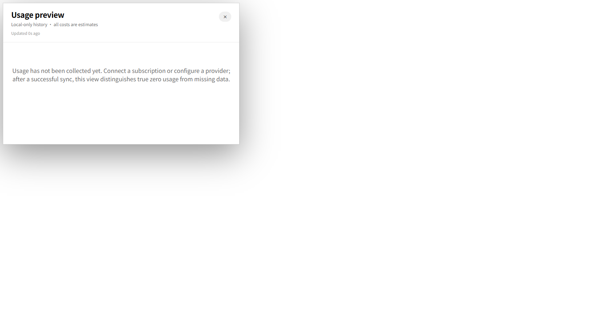
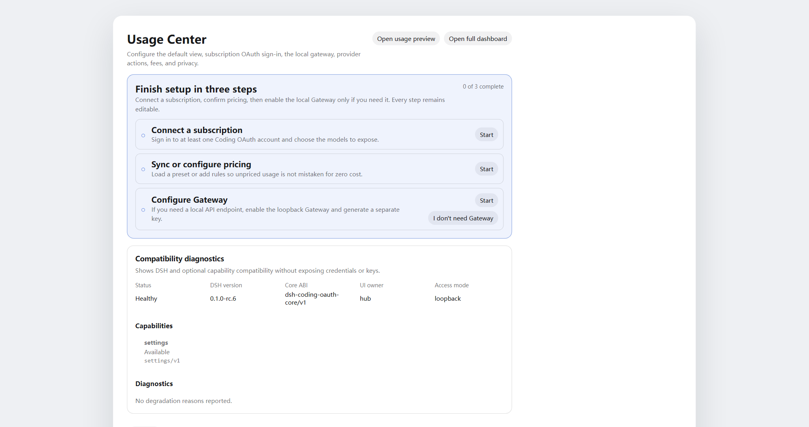
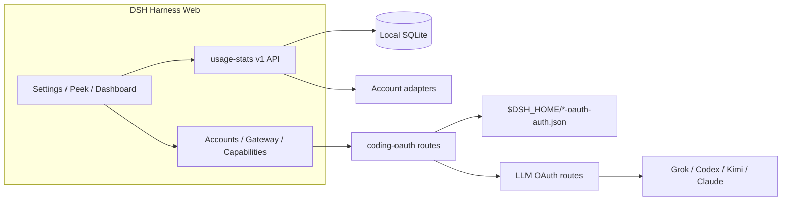

<!-- banner -->
<div align="center">

# dsh-hub-oauth-gateway

**v1.10.0** · anciennement `dsh-usage-stats`

**Centre d’usage local-first pour [DeepSeek Harness](https://github.com/deepseek-ai/dsh) Web.** Tokens, coût estimé, soldes de compte, quotas d’abonnement, tendances, prévisions, alertes et exports — plus OAuth d’abonnements coding (Grok Build, Codex, Kimi Code, Claude Code), une passerelle API loopback optionnelle et une surveillance locale opt-in auth/usage. **Ne collez pas de tokens dans le chat.**

[](https://github.com/lninghaha/dsh-hub-oauth-gateway/actions/workflows/ci.yml)
[](LICENSE)
[](.github/CONTRIBUTING.md)

*[English](README.md) · [中文版](README.zh-CN.md) · [日本語](README.ja.md) · [한국어](README.ko.md) · [Português (BR)](README.pt-BR.md) · [Español](README.es.md) · [Français](README.fr.md) · [Deutsch](README.de.md) · [Русский](README.ru.md)*

</div>

---

> **Upgrade / 升级：** Follow the versioned steps in [`docs/01-install.md`](docs/01-install.md). Install into the existing `web` profile, keep profile/config/credential files, and restart one existing DSH Web process after all packages are updated. When Hub and Subscription are both used, `dsh-coding-oauth-core@0.1.0` is their shared npm dependency, not a separate DSH plugin.

---

## Changement de nom

Publié initialement sous **`dsh-usage-stats`**. Le paquet et le dépôt sont désormais **`dsh-hub-oauth-gateway`** (à partir de **1.1.0**). Supprimez toute ancienne entrée avant de réinstaller. Les fichiers de données locaux et l’id interne du plugin Cordis restent identiques, l’historique d’usage est préservé.

| | Utilisez ceci | Fonctionne encore / inchangé |
|---|---|---|
| npm (recommandé) | `dsh plugin --profile web add dsh-hub-oauth-gateway` | L’ancien nom npm n’est plus mis à jour |
| GitHub / développement | [`dsh-hub-oauth-gateway`](https://github.com/lninghaha/dsh-hub-oauth-gateway) | — |
| id du plugin Cordis | `usage-stats` | inchangé |
| base SQLite | `${DSH_HOME}/storages/usage-stats-v1.sqlite` | inchangé |
| CLI | `dsh-coding-oauth` | `dsh-grok-build` (alias) |

Historique des releases dans [`CHANGELOG.md`](CHANGELOG.md).

## Fonctionnalités

- **Quick Peek + Full Dashboard** — HUD flottant (ou bouton barre latérale) ; onglets overview / trends / accounts / details / local ; today / 7d / 30d / month ; comparer période précédente ; refresh manuel.
- **Réglages par onglets** — Display / Accounts / Gateway / Capabilities / Providers / Fees sous Settings → Usage Center.
- **Presets et modules** — Minimal, Quota, Cost, Analyst ; ordre de modules personnalisé ; densité, motion, alias et couleurs des providers.
- **Carte de chaleur d’activité** — calendrier 370 jours + streak dans le fuseau configuré.
- **Historique local** — projette l’usage DSH dans SQLite par `(session, turn, step)` ; échantillons ultérieurs remplacent, jamais de double comptage.
- **Estimations de coût** — prix par million définis par l’utilisateur avec ratio de couverture ; prix manquants jamais traités comme gratuits.
- **Registre des frais d’abonnement** — coûts locaux abonnement/recharge ; multiples de payback quand les devises correspondent.
- **Tendances et prévisions** — buckets heure/jour/semaine/mois ; extrapolation linéaire bornée comme série distincte.
- **Adaptateurs compte et quota** — soldes, fenêtres, heures de reset, stale/last-success, alertes douces (pas de blocage dur, pas de notification sortante).
- **Export CSV / JSON** — mises en page filtrées, quotidiennes ou bundle ; rédaction de session optionnelle ; défense contre injection tableur.
- **OAuth abonnements coding** — Grok Build, Codex, Kimi Code, Claude Code via device code / browser / collage PKCE ; modèles affichés `(OAuth)` ; Pull unidirectionnel de credentials CLI.
- **Passerelle API loopback optionnelle** — serveur compatible OpenAI/Anthropic désactivé par défaut pour vos propres outils.
- **Capacités optionnelles** — Codex search / images / usage / Fast et Grok Imagine désactivés par défaut ; application live.
- **Moniteur local opt-in** — snapshots read-only auth CLI et scans cross-tool de tokens (jamais le contenu des conversations).
- **UI bilingue** — chinois et anglais via les services locale DSH.

Recherche produit : [`docs/research/usage-analytics-landscape.md`](docs/research/usage-analytics-landscape.md). Architecture : [`docs/02-architecture.md`](docs/02-architecture.md).

## Captures d’écran

Prises sur DeepSeek Harness Web avec ce plugin installé (un historique local vide est normal sur un profile isolé neuf).

<p align="center">
  
  <br />
  <em>HUD flottant — métrique du jour et puces de quota multi-comptes</em>
</p>

<p align="center">
  
  <br />
  <em>Quick Peek — KPI locaux uniquement, avec accès au tableau de bord complet</em>
</p>

<p align="center">
  
  <br />
  <em>Tableau de bord complet — plages, onglets, actualisation et export CSV / JSON</em>
</p>

<p align="center">
  
  <br />
  <em>Réglages → Usage Center — Affichage / Comptes / Gateway / Capacités / Fournisseurs / Frais</em>
</p>

## Problèmes résolus par ce plugin

| Vous avez cherché / vu | Ce qui était réellement cassé | Ce que fait ce plugin |
|---|---|---|
| Usage / coût / quota dispersés entre CLIs et providers | Pas d’historique local unique ni vue coût avec couverture | Projection SQLite + règles de prix + adaptateurs compte dans Usage Center |
| SuperGrok / ChatGPT Plus / Kimi Code / Claude Pro dans DSH sans autre facture API | Routes intégrées souvent pay-as-you-go API keys | Routes OAuth locales coexistent avec providers API-key existants |
| `本轮运行失败` **API key is invalid** / `AUTH` en milieu de turn | La GUI mappe tout `AUTH` à cette bannière ; access tokens OAuth expirent | Refresh proactif et retry conscient de AUTH sur routes coding OAuth |
| Outils compatibles OpenAI/Anthropic contre sessions d’abonnement | Pas de pont local sûr | Passerelle loopback opt-in (pas un relais public) |
| Statut CLI style Token Monitor sans coller de secrets | Fouille manuelle de fichiers ou collage dans le chat | localMonitor / localUsage opt-in sur chemins allowlisted hardened |

## Démarrage rapide

```bash
# 1. install the current npm release into the web profile
dsh plugin --profile web add dsh-hub-oauth-gateway

# 2. restart the resident DSH Web process (operator chooses when)
# Local service-manager example only; `dsh web` is the official CLI alias for the web profile.
# `dsh web` est l’alias CLI officiel, pas un nom de service. Utilisez le gestionnaire de processus réellement configuré.
```

Puis ouvrez **Settings → Usage Center**. Pour Accounts / Gateway / Capabilities, connectez-vous ou activez les switches selon besoin. Options d’installation complètes (installateur npx, tarball GitHub, proxy) dans [`docs/01-install.md`](docs/01-install.md).

## Table des matières

- [Changement de nom](#changement-de-nom)
- [Fonctionnalités](#fonctionnalités)
- [Captures d’écran](#captures-décran)
- [Problèmes résolus par ce plugin](#problèmes-résolus-par-ce-plugin)
- [Démarrage rapide](#démarrage-rapide)
- [Prérequis](#prérequis)
- [Installation](#installation)
- [Utilisation](#utilisation)
- [Réglages](#réglages)
- [Coding OAuth](#coding-oauth)
- [Passerelle API locale](#passerelle-api-locale)
- [Capacités optionnelles](#capacités-optionnelles)
- [Configuration runtime](#configuration-runtime)
- [Credentials](#credentials)
- [Données et migration](#données-et-migration)
- [Confidentialité et sécurité](#confidentialité-et-sécurité)
- [Architecture](#architecture)
- [Documentation](#documentation)
- [Contribution](#contribution)
- [Licence](#licence)

## Prérequis

- DeepSeek Harness Web, vérifié avec `@deepseek-ai/dsh 0.1.1-rc.2`
- Node.js `^22.19.0 || >=24.0.0`
- Backend DSH Web en loopback ; proxy inverse HTTPS local contrôlé vers réseau privé authentifié OK. N’exposez pas seule l’API du plugin ni ne publiez sans auth sur internet public.

## Installation

```bash
dsh plugin --profile web add dsh-hub-oauth-gateway
dsh plugin --profile web update dsh-hub-oauth-gateway
dsh plugin --profile web remove dsh-hub-oauth-gateway
```

Installateur compatible si le gestionnaire de plugins manque : `npx --yes dsh-hub-oauth-gateway-install`. Installations GitHub `/path/to/*.tgz` et de développement documentées dans [`docs/01-install.md`](docs/01-install.md). Après installation, redémarrez le processus DSH Web existant avec le gestionnaire réellement configuré, puis rafraîchissez `http://127.0.0.1:3080` ; DSH ne publie aucun nom de service universel.

## Utilisation

1. Ouvrez Quick Peek depuis le HUD flottant (ou bouton barre latérale sous **Settings → Display → entry mode**). Réglages lie aussi Peek / Full Dashboard.
2. Dans Full Dashboard, basculez overview / trends / accounts / details / local ; choisissez range, metric et dimensions provider/model.
3. Bouton refresh pour projection immédiate et refresh comptes. GET ordinaire lit uniquement snapshots locaux.
4. Configurez Display / Accounts / Gateway / Capabilities / Providers / Fees sous **Settings → Usage Center**.
5. Les coûts sont toujours des estimations — surveillez le pourcentage de couverture ; tokens non tarifés ne sont pas gratuits.

CLI : `dsh-coding-oauth login [--pkce] | import | status | logout` (`dsh-grok-build` est un alias).

## Réglages

**Settings → Usage Center** utilise six onglets supérieurs : **Display**, **Accounts**, **Gateway**, **Capabilities**, **Providers** et **Fees**. Cartes providers connectés repliées jusqu’à expansion. Chaque carte Providers gère son auth en ligne — enregistrer/effacer une API Key, auth device Copilot, actualisation par provider — et les cartes OAuth mènent directement à la connexion / au pull d’Accounts.

## Coding OAuth

Onglet **Accounts** : connectez Grok Build, Codex, Kimi Code ou Claude Code (device code préféré sur hôtes distants/headless ; browser/PKCE peut coller code ou URL de redirect complète). Modèles authentifiés apparaissent dans le sélecteur avec `(OAuth)`.

Fichiers OAuth CLI officiels allowlist découverts en read-only. Sync = **Pull** unidirectionnel explicite (discover → preview → confirm), jamais import auto et n’écrit jamais les fichiers CLI officiels.

## Passerelle API locale

**Désactivée** par défaut. Une fois activée, un listener `node:http` isolé (pas le port web DSH) sert `GET /healthz`, `GET /v1/models`, `POST /v1/chat/completions`, `POST /v1/responses` et `POST /v1/messages` en loopback, réutilisant sessions OAuth connectées. bind YAML uniquement ; bind non-loopback exige Bearer key. Ce n’est pas un relais distant. Détails : [`docs/01-install.md`](docs/01-install.md).

## Capacités optionnelles

Sept switches **désactivés** par défaut, application **live** : `codexSearch`, `codexImages`, `codexImageEdits`, `codexUsage`, `codexFast`, `grokImagineImage`, `grokImagineVideo`. Codex Fast / endpoints privés et Grok Imagine restent fail-closed jusqu’à activation. Voir [`docs/01-install.md`](docs/01-install.md) et [`docs/03-configuration.md`](docs/03-configuration.md).

## Configuration runtime

Fusionnez `config` sous l’entry Cordis existante — n’ajoutez pas de seconde entry :

```yaml
# ~/.dsh/profiles/web/cordis.patch.yml
- insert:
    - id: usage-stats
      name: dsh-hub-oauth-gateway
      config:
        refresh:
          usageSeconds: 30
          accountMinutes: 5
          accountConcurrency: 3
          timeoutMs: 15000
        retention:
          usageDays: 730
          accountSnapshotDays: 180
          preserveDeletedSessions: true
        pricing:
          baseCurrency: USD
        accounts:
          monitors: {}
        oauthDevice:
          copilotClientId: YOUR_PUBLIC_OAUTH_CLIENT_ID
        codingOAuth:
          enabled: true
        localMonitor:
          enabled: false
        localUsage:
          enabled: false
          intervalMinutes: 30
```

Référence complète des champs, monitors, proxy et import pricing : [`docs/03-configuration.md`](docs/03-configuration.md) et [`docs/01-install.md`](docs/01-install.md). `config.monitors` racine legacy mappe vers `config.accounts.monitors` (ne configurez pas les deux).

## Credentials

- Stockés via DSH credential seam ; le browser ne reçoit que métadonnées `configured` / `source` / `writable` — jamais les valeurs.
- Import CLI local (Claude, Codex, Gemini, Grok, Amp) ne journalise jamais chemins absolus.
- Flux device Copilot garde device code côté serveur ; browser ne détient qu’un flow ID aléatoire. Configurez votre propre public OAuth client ID avant activation.
- Fichiers Coding OAuth : `$DSH_HOME/.grok-build-auth.json` et autres `*-oauth-auth.json` (`0600`, écriture atomique). **Aucun statut HTTP, log ou UI ne doit retourner un token.**

## Données et migration

```text
${DSH_HOME:-~/.dsh}/storages/usage-stats-v1.sqlite
```

Répertoire `0700`, fichier principal `0600`, WAL. Rétention par défaut : 730 jours usage facts, 180 jours snapshots compte. Migration premier démarrage et notes rollback : [`docs/04-migration-v1.md`](docs/04-migration-v1.md).

## Confidentialité et sécurité

- Loopback peer + loopback Host ; corps d’écriture JSON ; règles same-origin / forwarded-host pour proxies inverses (`x-dsh-hub-oauth-gateway: 1`).
- GET ordinaire local uniquement ; refresh avec credentials = POST explicite ou planifié.
- Monitors : HTTPS par défaut, pas de credentials dans URL, redirects manuels, limites de taille, DNS pinning avant connexion.
- SQLite exclut credentials, prompts, responses, cwd et payloads bruts providers.
- Analytics et estimations ne sont pas des factures. Interrogez uniquement comptes et endpoints que vous possédez ou êtes autorisé à utiliser.

Modèle de menace et signalement : [`.github/SECURITY.md`](.github/SECURITY.md).

## Architecture



Détails : [`docs/02-architecture.md`](docs/02-architecture.md) · [中文](docs/02-architecture.zh-CN.md). Attribution OAuth : [`docs/oauth-provenance.md`](docs/oauth-provenance.md).

## Documentation

| Doc | Objectif |
|---|---|
| [`docs/01-install.md`](docs/01-install.md) | Installation, proxy, gateway, capabilities, dépannage |
| [`CHANGELOG.md`](CHANGELOG.md) | Historique des releases |
| [`docs/00-project-rules.md`](docs/00-project-rules.md) | Couches publication, versionnement, boucle release |
| [`docs/02-architecture.md`](docs/02-architecture.md) | Architecture interne · [中文](docs/02-architecture.zh-CN.md) |
| [`docs/03-configuration.md`](docs/03-configuration.md) | Référence configuration runtime |
| [`docs/04-migration-v1.md`](docs/04-migration-v1.md) | Migration données 1.0 |
| [`.github/CONTRIBUTING.md`](.github/CONTRIBUTING.md) | Guide de contribution |
| [`.github/SECURITY.md`](.github/SECURITY.md) | Politique de sécurité |

## Contribution

Vérifiez dans Cursor Cloud / workspace cloud de ce dépôt avec Node.js et pnpm déclarés (Docker sandbox optionnel, non requis). Utilisez `DSH_HOME` isolé pour smoke tests DSH. Voir [`.github/CONTRIBUTING.md`](.github/CONTRIBUTING.md). Gardez secrets, prompts et chemins personnels hors issues, PRs, captures et logs.

Si votre langue manque dans le sélecteur, ouvrez une PR avec traduction README et nous l’ajouterons.

## Licence

[MIT](LICENSE) · voir [NOTICE](NOTICE). Projet communautaire indépendant ; aucun aval fournisseur implicite. Parties Coding-OAuth conservent attribution Apache-2.0 si requis (`LICENSES/Apache-2.0.txt`).
