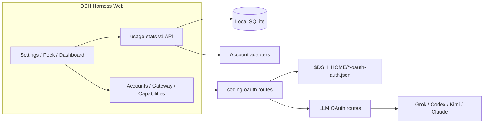

<!-- banner -->
<div align="center">

# dsh-hub-oauth-gateway

**v1.11.1** · 旧称 `dsh-usage-stats`

**[DeepSeek Harness](https://github.com/deepseek-ai/dsh) Web 向けのローカルファースト用量センター。** Token、推定コスト、口座残高、サブスクリプションクォータ、トレンド、予測、アラート、エクスポート — 加えてコーディングサブスクリプション OAuth（Grok Build、Codex、Kimi Code、Claude Code）、オプションのループバック API ゲートウェイ、オプトインのローカル認証/用量モニター。**チャットに token を貼り付けないでください。**

[](https://github.com/lninghaha/dsh-hub-oauth-gateway/actions/workflows/ci.yml)
[](LICENSE)
[](.github/CONTRIBUTING.md)

*[English](README.md) · [中文版](README.zh-CN.md) · [日本語](README.ja.md) · [한국어](README.ko.md) · [Português (BR)](README.pt-BR.md) · [Español](README.es.md) · [Français](README.fr.md) · [Deutsch](README.de.md) · [Русский](README.ru.md)*

</div>

---

> **Upgrade / 升级：** Follow the versioned steps in [`docs/01-install.md`](docs/01-install.md). Hub `1.11.1` and Subscription `0.6.4` share the verified DSH `0.1.1-rc.2` contract and pin `dsh-coding-oauth-core@0.1.1` with `undici@7.29.0`. Keep profile, configuration, and credential files, update both plugins in the same Web profile, then restart the existing DSH Web process once.

---

## 名称変更

当初 **`dsh-usage-stats`** として公開。**1.1.0** 以降、パッケージとリポジトリは **`dsh-hub-oauth-gateway`**。再インストール前に古い entry を削除してください。ローカルデータファイルと内部 Cordis プラグイン id は同じなので、履歴用量は保持されます。

| | こちらを使用 | 引き続き動作 / 変更なし |
|---|---|---|
| npm（推奨） | `dsh plugin --profile web add dsh-hub-oauth-gateway` | 旧 npm 名は更新されません |
| GitHub / 開発 | [`dsh-hub-oauth-gateway`](https://github.com/lninghaha/dsh-hub-oauth-gateway) | — |
| Cordis プラグイン id | `usage-stats` | 変更なし |
| SQLite データベース | `${DSH_HOME}/storages/usage-stats-v1.sqlite` | 変更なし |
| CLI | `dsh-coding-oauth` | `dsh-grok-build`（エイリアス） |

リリース履歴は [`CHANGELOG.md`](CHANGELOG.md)。

## 機能

- **Quick Peek + Full Dashboard** — フローティング HUD（またはサイドバーボタン）；概要 / トレンド / 口座 / 詳細 / ローカルのタブ；today / 7d / 30d / month；前期比較；手動更新。
- **タブ式設定** — Settings → Usage Center：Display / Accounts / Gateway / Capabilities / Providers / Fees。
- **プリセットとモジュール** — Minimal、Quota、Cost、Analyst；カスタムモジュール順；密度、モーション、プロバイダーエイリアスと色。
- **アクティビティヒートマップ** — 設定タイムゾーンで 370 日カレンダー + streak。
- **ローカル履歴** — DSH 用量を `(session, turn, step)` で SQLite に投影；後のサンプルで置換、二重カウントなし。
- **コスト推定** — ユーザー所有の百万 token 単価とカバレッジ率；価格未設定は無料扱いしません。
- **サブスクリプション料金台帳** — ローカルサブスクリプション/チャージコスト；通貨一致時に回収倍数。
- **トレンドと予測** — 時間/日/週/月バケット；有界線形外挿を独立シリーズとして。
- **口座とクォータアダプター** — 残高、ウィンドウ、リセット時刻、stale/last-success、ソフトアラート（ハードブロックなし、外部通知なし）。
- **CSV / JSON エクスポート** — フィルタ、日次、または bundle レイアウト；オプションのセッション秘匿；スプレッドシートインジェクション防御。
- **Coding-subscription OAuth** — Grok Build, Codex, Kimi Code, Claude Code via device code / browser / PKCE paste; optional GitHub Copilot LLM route when `oauthDevice.copilotClientId` is set; multi-account store (max 8) with optional `codingOAuth.pool` (`off` | `priority` | `quota_aware`); Claude Code import via **Import Claude Code** (macOS Keychain or file fallback; preview → commit; overwrite still needs confirm); models appear as `(OAuth)`; one-way CLI credential Pull.
- **オプションのループバック API ゲートウェイ** — デフォルト off の OpenAI/Anthropic 互換サーバー、自分のツール向け。
- **オプション機能** — Codex search / images / usage / Fast と Grok Imagine はデフォルト off；ライブ適用。
- **オプトインのローカルモニター** — 読み取り専用 CLI 認証スナップショットとクロスツール token スキャン（会話内容は読み取りません）。
- **二言語 UI** — DSH locale サービス経由の中国語と英語。

製品調査：[`docs/research/usage-analytics-landscape.md`](docs/research/usage-analytics-landscape.md)。アーキテクチャ：[`docs/02-architecture.md`](docs/02-architecture.md)。

## スクリーンショット

DeepSeek Harness Web に本プラグインを入れた状態で撮影（新規隔離 profile ではローカル履歴が空でも正常）。

<p align="center">
  
  <br />
  <em>フローティング HUD — 本日の指標と複数アカウントのクォータチップ</em>
</p>

<p align="center">
  
  <br />
  <em>Quick Peek — ローカルのみの KPI。ワンクリックでフルダッシュボードへ</em>
</p>

<p align="center">
  
  <br />
  <em>フルダッシュボード — 範囲・タブ・更新・CSV / JSON エクスポート</em>
</p>

<p align="center">
  
  <br />
  <em>設定 → Usage Center — 表示 / アカウント / ゲートウェイ / 機能 / プロバイダー / 費用</em>
</p>

## 本プラグインが解決する問題

| 検索 / 目にしたもの | 実際の問題 | 本プラグインの対応 |
|---|---|---|
| 用量 / コスト / クォータが各 CLI とプロバイダーに分散 | 統一ローカル履歴やカバレッジ付きコストビューがない | SQLite 投影 + 価格ルール + 口座アダプターを Usage Center に集約 |
| DSH で SuperGrok / ChatGPT Plus / Kimi Code / Claude Pro を追加 API 請求なしで | 組み込みルートは多くが従量 API key | ローカル OAuth ルートが既存 API-key プロバイダーと共存 |
| `本轮运行失败` **API key is invalid** / `AUTH` ターン途中 | GUI がすべての `AUTH` をそのバナーにマップ；OAuth access token は期限切れ | コーディング OAuth ルートで proactive refresh と AUTH 対応リトライ |
| サブスクリプションセッション向け OpenAI/Anthropic 互換ツール | 安全なローカルブリッジがない | オプトインのループバックゲートウェイ（公開リレーではない） |
| Token Monitor 風 CLI 状態を秘密貼り付けなしで | 手動ファイル探索またはチャット貼り付け | オプトイン localMonitor / localUsage、硬化 allowlist パス |

## クイックスタート

```bash
# 1. install the current npm release into the web profile
dsh plugin --profile web add dsh-hub-oauth-gateway

# 2. restart the resident DSH Web process (operator chooses when)
# Local service-manager example only; `dsh web` is the official CLI alias for the web profile.
# `dsh web` は公式 CLI エイリアスであり、サービス名ではありません。実際に設定したプロセスマネージャーを使ってください。
```

次に **Settings → Usage Center** を開く。Accounts / Gateway / Capabilities は必要に応じてサインインまたはスイッチを有効化。完全なインストールオプション（npx インストーラー、GitHub tarball、プロキシ）は [`docs/01-install.md`](docs/01-install.md)。

## 目次

- [名称変更](#名称変更)
- [機能](#機能)
- [スクリーンショット](#スクリーンショット)
- [本プラグインが解決する問題](#本プラグインが解決する問題)
- [クイックスタート](#クイックスタート)
- [要件](#要件)
- [インストール](#インストール)
- [使い方](#使い方)
- [設定](#設定)
- [Coding OAuth](#coding-oauth)
- [ローカル API ゲートウェイ](#ローカル-api-ゲートウェイ)
- [オプション機能](#オプション機能)
- [ランタイム設定](#ランタイム設定)
- [認証情報](#認証情報)
- [データと移行](#データと移行)
- [プライバシーとセキュリティ](#プライバシーとセキュリティ)
- [アーキテクチャ](#アーキテクチャ)
- [ドキュメント](#ドキュメント)
- [コントリビューション](#コントリビューション)
- [ライセンス](#ライセンス)

## 要件

- DeepSeek Harness Web、`@deepseek-ai/dsh 0.1.1-rc.2` で検証済み
- Node.js `^22.19.0 || >=24.0.0`
- ループバック DSH Web バックエンド；認証済みプライベートネットワークへの制御されたローカル HTTPS リバースプロキシは可。プラグイン API 単体の公開や無認証の公インターネット公開はしないでください。

## インストール

```bash
dsh plugin --profile web add dsh-hub-oauth-gateway
dsh plugin --profile web update dsh-hub-oauth-gateway
dsh plugin --profile web remove dsh-hub-oauth-gateway
```

プラグインマネージャーがない場合の互換インストーラー：`npx --yes dsh-hub-oauth-gateway-install`。GitHub `/path/to/*.tgz` と開発パスインストールは [`docs/01-install.md`](docs/01-install.md)。インストール後、実際に設定したプロセスマネージャーで既存の DSH Web プロセスを再起動し、`http://127.0.0.1:3080` を更新してください。DSH は共通のサービス名を提供しません。

## 使い方

1. フローティング HUD（または **Settings → Display → entry mode** のサイドバーボタン）から Quick Peek を開く。設定から Peek / Full Dashboard もリンク。
2. Full Dashboard で overview / trends / accounts / details / local を切り替え；range、metric、provider/model 次元を選択。
3. 更新ボタンで即時投影と口座更新。通常の GET はローカルスナップショットのみ読み取り。
4. **Settings → Usage Center** で Display / Accounts / Gateway / Capabilities / Providers / Fees を設定。
5. コストは常に推定 — カバレッジ率に注意；未価格 token は無料ではありません。

CLI：`dsh-coding-oauth login [--pkce] | import | status | logout`（`dsh-grok-build` はエイリアス）。

## 設定

**Settings → Usage Center** は 6 つのトップタブ：**Display**、**Accounts**、**Gateway**、**Capabilities**、**Providers**、**Fees**。サインイン済みプロバイダーカードは展開まで折りたたみ。Providers の各カードで認証を直接管理——API Key の保存/削除、Copilot デバイス認証、プロバイダー単位の更新。OAuth カードから Accounts のサインイン/取り込みへ直接移動可能。

## Coding OAuth

**Accounts** タブで Grok Build、Codex、Kimi Code、Claude Code にサインイン（リモート/ヘッドレスでは device code 推奨；ブラウザ/PKCE はコードまたは完全な redirect URL を貼り付け可）。認証済みモデルは `(OAuth)` 付きでセレクターに表示。

allowlist 内の公式 CLI OAuth ファイルは読み取り専用で発見。同期は明示的な一方向 **Pull**（discover → preview → confirm）、自動インポートなし、公式 CLI ファイルへの書き込みなし。

## ローカル API ゲートウェイ

デフォルト **off**。有効時、独立した `node:http` リスナー（DSH web ポートではない）がループバックで `GET /healthz`、`GET /v1/models`、`POST /v1/chat/completions`、`POST /v1/responses`、`POST /v1/messages` を提供し、サインイン済み OAuth セッションを再利用。bind は YAML のみ；非ループバック bind には Bearer key が必要。リモートリレーではありません。詳細：[`docs/01-install.md`](docs/01-install.md)。

## オプション機能

7 つのスイッチはデフォルト **off**、**live** 適用：`codexSearch`、`codexImages`、`codexImageEdits`、`codexUsage`、`codexFast`、`grokImagineImage`、`grokImagineVideo`。Codex Fast / プライベートエンドポイントと Grok Imagine は有効化まで fail-closed。[`docs/01-install.md`](docs/01-install.md) と [`docs/03-configuration.md`](docs/03-configuration.md) を参照。

## ランタイム設定

既存 Cordis entry 下で `config` をマージ — 2 つ目の entry を追加しない：

```yaml
# ~/.dsh/profiles/web/cordis.patch.yml
- insert:
    - id: usage-stats
      name: dsh-hub-oauth-gateway
      config:
        refresh:
          usageSeconds: 30
          accountMinutes: 5
          accountConcurrency: 3
          timeoutMs: 15000
        retention:
          usageDays: 730
          accountSnapshotDays: 180
          preserveDeletedSessions: true
        pricing:
          baseCurrency: USD
        accounts:
          monitors: {}
        oauthDevice:
          copilotClientId: YOUR_PUBLIC_OAUTH_CLIENT_ID
        codingOAuth:
          enabled: true
          pool:
            mode: off
            # switchMargin: 2
        localMonitor:
          enabled: false
        localUsage:
          enabled: false
          intervalMinutes: 30
```

完全なフィールド参照、monitors、proxy、pricing import：[`docs/03-configuration.md`](docs/03-configuration.md) と [`docs/01-install.md`](docs/01-install.md)。レガシー root `config.monitors` は `config.accounts.monitors` にマップ（両方設定しない）。

## 認証情報

- DSH credential seam 経由で保存；ブラウザは `configured` / `source` / `writable` メタデータのみ受信 — 値は受信しません。
- ローカル CLI インポート（Claude、Codex、Gemini、Grok、Amp）は絶対パスをログしません。
- Copilot device flow は device code をサーバー側に保持；ブラウザはランダム flow ID のみ。有効化前に自分の public OAuth client ID を設定。
- Coding OAuth ファイル：`$DSH_HOME/.grok-build-auth.json` およびその他 `*-oauth-auth.json`（`0600`、atomic write）。**HTTP ステータス、ログ、UI のいずれも token を返してはなりません。**

## データと移行

```text
${DSH_HOME:-~/.dsh}/storages/usage-stats-v1.sqlite
```

ディレクトリ `0700`、メインファイル `0600`、WAL。デフォルト保持：730 日 usage facts、180 日口座スナップショット。初回起動移行とロールバック：[`docs/04-migration-v1.md`](docs/04-migration-v1.md)。

## プライバシーとセキュリティ

- ループバック peer + ループバック Host；JSON 書き込みボディ；リバースプロキシ向け same-origin / forwarded-host ルール（`x-dsh-hub-oauth-gateway: 1`）。
- 通常 GET はローカルのみ；認証情報付き更新は明示 POST またはスケジュール。
- Monitors：デフォルト HTTPS、URL 埋め込み認証情報なし、手動 redirect、サイズ制限、接続前 DNS pinning。
- SQLite は認証情報、prompt、response、cwd、生プロバイダーペイロードを除外。
- 分析と推定は請求書ではありません。所有または認可された口座と endpoint のみクエリ。

脅威モデルと報告：[`.github/SECURITY.md`](.github/SECURITY.md)。

## アーキテクチャ



詳細：[`docs/02-architecture.md`](docs/02-architecture.md) · [中文](docs/02-architecture.zh-CN.md)。OAuth 帰属：[`docs/oauth-provenance.md`](docs/oauth-provenance.md)。

## ドキュメント

| Doc | 目的 |
|---|---|
| [`docs/01-install.md`](docs/01-install.md) | インストール、proxy、gateway、capabilities、トラブルシューティング |
| [`CHANGELOG.md`](CHANGELOG.md) | リリース履歴 |
| [`docs/00-project-rules.md`](docs/00-project-rules.md) | 公開レイヤー、バージョニング、リリースループ |
| [`docs/02-architecture.md`](docs/02-architecture.md) | 内部アーキテクチャ · [中文](docs/02-architecture.zh-CN.md) |
| [`docs/03-configuration.md`](docs/03-configuration.md) | ランタイム設定リファレンス |
| [`docs/04-migration-v1.md`](docs/04-migration-v1.md) | 1.0 データ移行 |
| [`.github/CONTRIBUTING.md`](.github/CONTRIBUTING.md) | コントリビューションガイド |
| [`.github/SECURITY.md`](.github/SECURITY.md) | セキュリティポリシー |

## コントリビューション

Cursor Cloud / 本リポジトリのクラウドワークスペースで宣言された Node.js と pnpm で検証（Docker sandbox はオプション、必須ではありません）。DSH スモークテストには隔離 `DSH_HOME` を使用。[`.github/CONTRIBUTING.md`](.github/CONTRIBUTING.md) を参照。issue、PR、スクリーンショット、ログに秘密、prompt、個人パスを含めないでください。

言語切り替え行にあなたの言語がない場合、README 翻訳の PR を開いてください。

## ライセンス

[MIT](LICENSE) · [NOTICE](NOTICE) を参照。独立したコミュニティプロジェクト；ベンダー後援は暗示されません。Coding-OAuth 部分は必要に応じて Apache-2.0 帰属を保持（`LICENSES/Apache-2.0.txt`）。
