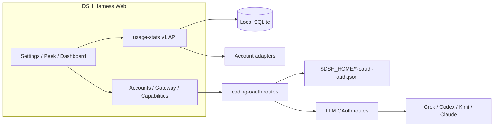

<!-- banner -->
<div align="center">

# dsh-hub-oauth-gateway

**v1.7.2** · 이전 이름 `dsh-usage-stats`

**[DeepSeek Harness](https://github.com/deepseek-ai/dsh) Web용 로컬 우선 사용량 센터.** Token, 추정 비용, 계정 잔액, 구독 할당량, 추세, 예측, 알림, 내보내기 — 코딩 구독 OAuth(Grok Build, Codex, Kimi Code, Claude Code), 선택적 루프백 API 게이트웨이, 옵트인 로컬 인증/사용량 모니터링 포함. **채팅에 token을 붙여넣지 마세요.**

[](https://github.com/lninghaha/dsh-hub-oauth-gateway/actions/workflows/ci.yml)
[](LICENSE)
[](.github/CONTRIBUTING.md)

*[English](README.md) · [中文版](README.zh-CN.md) · [日本語](README.ja.md) · [한국어](README.ko.md) · [Português (BR)](README.pt-BR.md) · [Español](README.es.md) · [Français](README.fr.md) · [Deutsch](README.de.md) · [Русский](README.ru.md)*

</div>

---

## 이름 변경

처음 **`dsh-usage-stats`** 로 출시되었습니다. **1.1.0** 부터 패키지와 저장소는 **`dsh-hub-oauth-gateway`** 입니다. 재설치 전에 이전 entry를 제거하세요. 로컬 데이터 파일과 내부 Cordis 플러그인 id는 동일하므로 과거 사용량이 보존됩니다.

| | 이것을 사용 | 여전히 작동 / 변경 없음 |
|---|---|---|
| npm(권장) | `dsh plugin --profile web add dsh-hub-oauth-gateway` | 이전 npm 이름은 더 이상 업데이트되지 않음 |
| GitHub / 개발 | [`dsh-hub-oauth-gateway`](https://github.com/lninghaha/dsh-hub-oauth-gateway) | — |
| Cordis 플러그인 id | `usage-stats` | 변경 없음 |
| SQLite 데이터베이스 | `${DSH_HOME}/storages/usage-stats-v1.sqlite` | 변경 없음 |
| CLI | `dsh-coding-oauth` | `dsh-grok-build`(별칭) |

릴리스 기록은 [`CHANGELOG.md`](CHANGELOG.md).

## 기능

- **Quick Peek + Full Dashboard** — 플로팅 HUD(또는 사이드바 버튼); 개요 / 추세 / 계정 / 상세 / 로컬 탭; today / 7d / 30d / month; 이전 기간 비교; 수동 새로고침.
- **탭형 설정** — Settings → Usage Center: Display / Accounts / Gateway / Capabilities / Providers / Fees.
- **프리셋과 모듈** — Minimal, Quota, Cost, Analyst; 사용자 지정 모듈 순서; 밀도, 모션, 프로바이더 별칭과 색상.
- **활동 히트맵** — 설정된 시간대에서 370일 캘린더 + streak.
- **로컬 기록** — DSH 사용량을 `(session, turn, step)` 으로 SQLite에 투영; 이후 샘플이 대체, 이중 집계 없음.
- **비용 추정** — 사용자 소유 백만 token 단가와 커버리지 비율; 가격 누락은 절대 무료로 처리하지 않음.
- **구독 요금 원장** — 로컬 구독/충전 비용; 통화 일치 시 회수 배수.
- **추세와 예측** — 시간/일/주/월 버킷; 유계 선형 외삽을 별도 시리즈로.
- **계정 및 할당량 어댑터** — 잔액, 윈도우, 리셋 시각, stale/last-success, 소프트 알림(하드 차단 없음, 외부 알림 없음).
- **CSV / JSON 내보내기** — 필터, 일별 또는 bundle 레이아웃; 선택적 세션 마스킹; 스프레드시트 인젝션 방어.
- **코딩 구독 OAuth** — Grok Build, Codex, Kimi Code, Claude Code(device code / 브라우저 / PKCE 붙여넣기); 모델은 `(OAuth)` 표시; 일방향 CLI凭据 Pull.
- **선택적 루프백 API 게이트웨이** — 기본 off OpenAI/Anthropic 호환 서버, 자신의 도구용.
- **선택적 기능** — Codex search / images / usage / Fast와 Grok Imagine 기본 off; live 적용.
- **옵트인 로컬 모니터** — 읽기 전용 CLI 인증 스냅샷과 크로스툴 token 스캔(대화 내용은 읽지 않음).
- **이중 언어 UI** — DSH locale 서비스를 통한 중국어와 영어.

제품 조사: [`docs/research/usage-analytics-landscape.md`](docs/research/usage-analytics-landscape.md). 아키텍처: [`docs/02-architecture.md`](docs/02-architecture.md).

## 스크린샷

DeepSeek Harness Web에 이 플러그인을 설치한 뒤 촬영했습니다(새 격리 profile에서는 로컬 기록이 비어 있어도 정상).

<p align="center">
  
  <br />
  <em>플로팅 HUD — 오늘 지표와 다중 계정 할당량 칩</em>
</p>

<p align="center">
  
  <br />
  <em>Quick Peek — 로컬 KPI만 표시, 원클릭으로 전체 대시보드</em>
</p>

<p align="center">
  
  <br />
  <em>전체 대시보드 — 범위, 탭, 새로고침, CSV / JSON 내보내기</em>
</p>

<p align="center">
  
  <br />
  <em>설정 → Usage Center — 표시 / 계정 / 게이트웨이 / 기능 / 프로바이더 / 비용</em>
</p>

## 이 플러그인이 해결하는 문제

| 검색 / 본 것 | 실제로 깨진 것 | 이 플러그인이 하는 일 |
|---|---|---|
| 사용량 / 비용 / 할당량이 CLI와 프로바이더에 분산 | 통합 로컬 기록이나 커버리지 인식 비용 뷰 없음 | SQLite 투영 + 가격 규칙 + 계정 어댑터를 Usage Center에 집중 |
| DSH에서 SuperGrok / ChatGPT Plus / Kimi Code / Claude Pro를 추가 API 요금 없이 | 내장 경로는 종종 종량제 API key | 로컬 OAuth 경로가 기존 API-key 프로바이더와 공존 |
| `本轮运行失败` **API key is invalid** / `AUTH` 턴 중 | GUI가 모든 `AUTH`를 해당 배너에 매핑; OAuth access token 만료 | 코딩 OAuth 경로에서 proactive refresh와 AUTH 인식 재시도 |
| 구독 세션에 OpenAI/Anthropic 호환 도구 원함 | 안전한 로컬 브리지 없음 | 옵트인 루프백 게이트웨이(공개 릴레이 아님) |
| Token Monitor 스타일 CLI 상태를 비밀 붙여넣기 없이 | 수동 파일 탐색 또는 채팅 붙여넣기 | 옵트인 localMonitor / localUsage, hardened allowlist 경로 |

## 빠른 시작

```bash
# 1. install the current npm release into the web profile
dsh plugin --profile web add dsh-hub-oauth-gateway

# 2. restart the resident dsh web service (operator chooses when)
systemctl --user restart dsh-web.service
# or: dsh-web restart
```

그다음 **Settings → Usage Center** 를 여세요. Accounts / Gateway / Capabilities는 필요에 따라 로그인하거나 스위치를 켜세요. 전체 설치 옵션(npx 설치기, GitHub tarball, proxy)은 [`docs/01-install.md`](docs/01-install.md).

## 목차

- [이름 변경](#이름-변경)
- [기능](#기능)
- [스크린샷](#스크린샷)
- [이 플러그인이 해결하는 문제](#이-플러그인이-해결하는-문제)
- [빠른 시작](#빠른-시작)
- [요구 사항](#요구-사항)
- [설치](#설치)
- [사용법](#사용법)
- [설정](#설정)
- [Coding OAuth](#coding-oauth)
- [로컬 API 게이트웨이](#로컬-api-게이트웨이)
- [선택적 기능](#선택적-기능)
- [런타임 설정](#런타임-설정)
- [凭据](#凭据)
- [데이터와 마이그레이션](#데이터와-마이그레이션)
- [개인정보와 보안](#개인정보와-보안)
- [아키텍처](#아키텍처)
- [문서](#문서)
- [기여](#기여)
- [라이선스](#라이선스)

## 요구 사항

- DeepSeek Harness Web, `@deepseek-ai/dsh 0.1.0-rc.6` 검증됨
- Node.js `^22.19.0 || >=24.0.0`
- 루프백 DSH Web 백엔드; 인증된 프라이빗 네트워크로의 제어된 로컬 HTTPS 리버스 프록시는 가능. 플러그인 API만 단독 노출하거나 무인증으로 공인 인터넷에 게시하지 마세요.

## 설치

```bash
dsh plugin --profile web add dsh-hub-oauth-gateway
dsh plugin --profile web update dsh-hub-oauth-gateway
dsh plugin --profile web remove dsh-hub-oauth-gateway
```

플러그인 관리자가 없을 때 호환 설치기: `npx --yes dsh-hub-oauth-gateway-install`. GitHub `/path/to/*.tgz` 및 개발 경로 설치는 [`docs/01-install.md`](docs/01-install.md). 설치 후 Web을 직접 재시작(`dsh-web restart` 또는 `systemctl --user restart dsh-web.service`), `http://127.0.0.1:3080` 새로고침.

## 사용법

1. 플로팅 HUD(또는 **Settings → Display → entry mode** 의 사이드바 버튼)에서 Quick Peek 열기. 설정에서도 Peek / Full Dashboard 링크.
2. Full Dashboard에서 overview / trends / accounts / details / local 전환; range, metric, provider/model 차원 선택.
3. 새로고침 버튼으로 즉시 투영 및 계정 새로고침. 일반 GET은 로컬 스냅샷만 읽음.
4. **Settings → Usage Center** 에서 Display / Accounts / Gateway / Capabilities / Providers / Fees 구성.
5. 비용은 항상 추정 — 커버리지 비율 확인; 미가격 token은 무료가 아님.

CLI: `dsh-coding-oauth login [--pkce] | import | status | logout`(`dsh-grok-build`는 별칭).

## 설정

**Settings → Usage Center** 는 6개 상단 탭: **Display**, **Accounts**, **Gateway**, **Capabilities**, **Providers**, **Fees**. 로그인된 프로바이더 카드는 펼치기 전까지 접힘. API Key / Copilot device auth는 Providers 아래.

## Coding OAuth

**Accounts** 탭에서 Grok Build, Codex, Kimi Code, Claude Code 로그인(원격/헤드리스에서는 device code 권장; 브라우저/PKCE는 코드 또는 전체 redirect URL 붙여넣기). 인증된 모델은 `(OAuth)` 와 함께 선택기에 표시.

allowlist 내 공식 CLI OAuth 파일은 읽기 전용으로 발견. 동기화는 명시적 일방향 **Pull**(discover → preview → confirm), 자동 import 없음, 공식 CLI 파일에 쓰지 않음.

## 로컬 API 게이트웨이

기본 **off**. 활성화 시 격리된 `node:http` 리스너(DSH web 포트 아님)가 루프백에서 `GET /healthz`, `GET /v1/models`, `POST /v1/chat/completions`, `POST /v1/responses`, `POST /v1/messages` 제공, 로그인된 OAuth 세션 재사용. bind는 YAML 전용; 비루프백 bind에는 Bearer key 필요. 원격 릴레이가 아님. 자세히: [`docs/01-install.md`](docs/01-install.md).

## 선택적 기능

7개 스위치 기본 **off**, **live** 적용: `codexSearch`, `codexImages`, `codexImageEdits`, `codexUsage`, `codexFast`, `grokImagineImage`, `grokImagineVideo`. Codex Fast / private endpoint와 Grok Imagine은 활성화 전까지 fail-closed. [`docs/01-install.md`](docs/01-install.md) 및 [`docs/03-configuration.md`](docs/03-configuration.md) 참조.

## 런타임 설정

기존 Cordis entry 아래 `config` 병합 — 두 번째 entry 추가 금지:

```yaml
# ~/.dsh/profiles/web/cordis.patch.yml
- insert:
    - id: usage-stats
      name: dsh-hub-oauth-gateway
      config:
        refresh:
          usageSeconds: 30
          accountMinutes: 5
          accountConcurrency: 3
          timeoutMs: 15000
        retention:
          usageDays: 730
          accountSnapshotDays: 180
          preserveDeletedSessions: true
        pricing:
          baseCurrency: USD
        accounts:
          monitors: {}
        oauthDevice:
          copilotClientId: YOUR_PUBLIC_OAUTH_CLIENT_ID
        codingOAuth:
          enabled: true
        localMonitor:
          enabled: false
        localUsage:
          enabled: false
          intervalMinutes: 30
```

전체 필드 참조, monitors, proxy, pricing import: [`docs/03-configuration.md`](docs/03-configuration.md) 및 [`docs/01-install.md`](docs/01-install.md). 레거시 root `config.monitors`는 `config.accounts.monitors`로 매핑(둘 다 설정하지 말 것).

## 凭据

- DSH credential seam을 통해 저장; 브라우저는 `configured` / `source` / `writable` 메타데이터만 수신 — 값은 수신하지 않음.
- 로컬 CLI import(Claude, Codex, Gemini, Grok, Amp)는 절대 경로를 로그하지 않음.
- Copilot device flow는 device code를 서버 측에 유지; 브라우저는 랜덤 flow ID만 보유. 활성화 전에 자신의 public OAuth client ID 구성.
- Coding OAuth 파일: `$DSH_HOME/.grok-build-auth.json` 및 기타 `*-oauth-auth.json`(`0600`, atomic write). **HTTP 상태, 로그, UI 어디에도 token을 반환해서는 안 됨.**

## 데이터와 마이그레이션

```text
${DSH_HOME:-~/.dsh}/storages/usage-stats-v1.sqlite
```

디렉터리 `0700`, 메인 파일 `0600`, WAL. 기본 보존: 730일 usage facts, 180일 계정 스냅샷. 첫 시작 마이그레이션 및 롤백: [`docs/04-migration-v1.md`](docs/04-migration-v1.md).

## 개인정보와 보안

- 루프백 peer + 루프백 Host; JSON 쓰기 본문; 리버스 프록시용 same-origin / forwarded-host 규칙(`x-dsh-hub-oauth-gateway: 1`).
- 일반 GET은 로컬 전용;凭据 포함 새로고침은 명시 POST 또는 스케줄.
- Monitors: 기본 HTTPS, URL 내장凭据 없음, 수동 redirect, 크기 제한, 연결 전 DNS pinning.
- SQLite는凭据, prompt, response, cwd, 원시 프로바이더 페이로드 제외.
- 분석과 추정은 청구서가 아님. 소유하거나 권한 있는 계정과 endpoint만 쿼리.

위협 모델 및 보고: [`.github/SECURITY.md`](.github/SECURITY.md).

## 아키텍처



자세히: [`docs/02-architecture.md`](docs/02-architecture.md) · [中文](docs/02-architecture.zh-CN.md). OAuth 출처: [`docs/oauth-provenance.md`](docs/oauth-provenance.md).

## 문서

| Doc | 목적 |
|---|---|
| [`docs/01-install.md`](docs/01-install.md) | 설치, proxy, gateway, capabilities, 문제 해결 |
| [`CHANGELOG.md`](CHANGELOG.md) | 릴리스 기록 |
| [`docs/00-project-rules.md`](docs/00-project-rules.md) | 공개 계층, 버전 관리, 릴리스 루프 |
| [`docs/02-architecture.md`](docs/02-architecture.md) | 내부 아키텍처 · [中文](docs/02-architecture.zh-CN.md) |
| [`docs/03-configuration.md`](docs/03-configuration.md) | 런타임 설정 참조 |
| [`docs/04-migration-v1.md`](docs/04-migration-v1.md) | 1.0 데이터 마이그레이션 |
| [`.github/CONTRIBUTING.md`](.github/CONTRIBUTING.md) | 기여 가이드 |
| [`.github/SECURITY.md`](.github/SECURITY.md) | 보안 정책 |

## 기여

Cursor Cloud / 이 저장소 클라우드 워크스페이스에서 선언된 Node.js와 pnpm으로 검증(Docker sandbox는 선택, 필수 아님). DSH 스모크 테스트에는 격리 `DSH_HOME` 사용. [`.github/CONTRIBUTING.md`](.github/CONTRIBUTING.md) 참조. issue, PR, 스크린샷, 로그에 비밀, prompt, 개인 경로를 넣지 마세요.

언어 전환 줄에 내 언어가 없으면 README 번역 PR을 열어 주세요.

## 라이선스

[MIT](LICENSE) · [NOTICE](NOTICE) 참조. 독립 커뮤니티 프로젝트; 벤더 후원은 암시되지 않음. Coding-OAuth 부분은 필요 시 Apache-2.0 귀속 유지(`LICENSES/Apache-2.0.txt`).
