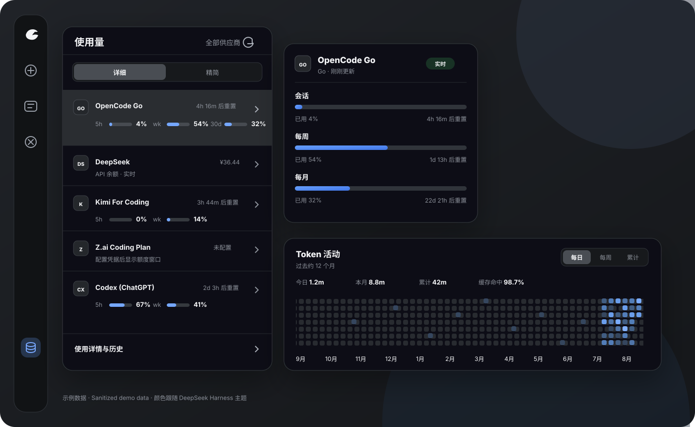

# dsh-usage-stats

[](https://github.com/Ychris12138/dsh-usage-stats/releases/latest)
[](https://github.com/Ychris12138/dsh-usage-stats/actions/workflows/ci.yml)
[](LICENSE)

为 [DeepSeek Harness](https://github.com/deepseek-ai/deepseek-harness) 网页端提供多供应商账户监测与 Token 用量分析。

Provider balances, subscription quotas, and token-usage analytics for the DeepSeek Harness Web GUI (`dsh web`).



> 展示图使用脱敏演示数据；插件不会把 API Key、Cookie、管理 PAT 或上游原始响应发送到浏览器。

## 一眼看懂 / At a glance

| | 能力 | 说明 |
| --- | --- | --- |
| 💳 | 多账户总览 | 同屏列出全部 provider；API 供应商显示余额摘要，Token Plan 显示分窗口额度，点击后在右侧查看明细 |
| 📊 | Token 用量分析 | 今日、本月、累计、缓存命中率、约 12 个月紧凑热力图，以及按日期/供应商/模型下钻 |
| 🔄 | 后台监测 | 服务端启动即刷新，之后每五分钟更新全部已配置账户与本地 Token 聚合 |
| 🧩 | 可扩展适配器 | 支持 New API、Sub2API、通用余额模板，以及声明式 JSON Pointer 自定义查询 |
| 🔒 | 本机安全边界 | 全部端点仅接受回环请求，只读端点仅接受 GET；凭据只在服务端解析并发往校验后的供应商地址 |

- 界面支持中文和英文，并完全复用 DSH 的语义颜色 token，亮色、暗色和跟随系统主题会同步切换。
- 后台刷新与面板是否打开无关；列表读取服务端缓存摘要，点击账户再读取该 provider 的统一快照。
- 标题栏手动刷新会更新 Token 并强制刷新全部已配置账户。
- 点击弹窗外或按 `Escape` 会先收起明细，再关闭整个弹窗。

## 快速安装 / Quick start

需要 DeepSeek Harness `web` profile（`@deepseek-ai/dsh >= 0.1.0-rc.6`）。

```bash
dsh plugin --profile web add "github:Ychris12138/dsh-usage-stats"
```

然后重启已经运行的 `dsh web`，并在浏览器中硬刷新。侧边栏底部会出现“用量/余额”（Usage/Balance）入口。

升级或卸载：

```bash
dsh plugin --profile web update dsh-usage-stats
dsh plugin --profile web remove dsh-usage-stats
```

<details>
<summary><strong>兼容安装器：无法使用 dsh plugin 时展开</strong></summary>

PowerShell、命令提示符和 macOS/Linux 终端使用同一条命令：

```bash
npx --yes github:Ychris12138/dsh-usage-stats
```

安装器会把运行文件复制到 `~/.dsh/profiles/node_modules/dsh-usage-stats`，并在 `profiles/web/cordis.patch.yml` 中幂等启用插件。重复运行即可更新，不会重复追加配置。设置了 `DSH_HOME` 时使用该目录。

`dsh plugin` 与 `npx` 是两条独立安装路径，请选择其中一种；不要同时保留手工 Cordis entry 和 bundle 注册，否则会重复挂载。

```bash
# 预览，不修改文件
npx --yes github:Ychris12138/dsh-usage-stats --dry-run

# 检查现有安装
npx --yes github:Ychris12138/dsh-usage-stats --check

# 安装但不修改 Cordis patch
npx --yes github:Ychris12138/dsh-usage-stats --no-enable
```

无法使用 `npx` 时可从源码运行 `node scripts/install.mjs`。

</details>

## 支持的账户类型 / Providers

插件自动发现官方 DeepSeek 路由和 `llm-pi-ai` 中的 provider profile。只有存在公开账户接口或显式 monitor 的供应商才会查询远端账户；Token 用量统计不需要额外凭据。

| Provider / adapter | 模式 | 默认凭据 | 上游接口 |
| --- | --- | --- | --- |
| DeepSeek | 余额 | provider `apiKeyEnv` | `/user/balance` |
| OpenRouter | 余额 | `OPENROUTER_MANAGEMENT_KEY` | `/api/v1/credits` |
| Moonshot / Kimi API | 余额 | provider `apiKeyEnv` | `/v1/users/me/balance` |
| DashScope / 百炼 | 余额 | `DASHSCOPE_API_KEY` | `/api/v1/api-key/dashboard` |
| SiliconFlow | 余额 | `SILICONFLOW_API_KEY` | `/v1/user/info` |
| OpenCode Go | 订阅 | `OPENCODE_GO_API_KEY` 或本地 `auth.json` | `/zen/go/v1/usage` |
| Z.ai / 智谱 | 订阅 | `ZAI_API_KEY` | Coding Plan quota/subscription |
| Kimi For Coding | 订阅 | `KIMI_API_KEY` | `/coding/v1/usages` |
| MiniMax Coding Plan | 订阅 | `MINIMAX_API_KEY` | `/v1/token_plan/remains` |
| Claude (Anthropic) | 订阅 | `CLAUDE_OAUTH_TOKEN` | `/api/oauth/usage` |
| Codex (ChatGPT) | 订阅 | `CODEX_ACCESS_TOKEN` | `/backend-api/wham/usage` |
| Gemini Code Assist | 订阅 | `GEMINI_ACCESS_TOKEN` | `cloudcode-pa.googleapis.com` quota |
| GitHub Copilot | 订阅 | `GITHUB_COPILOT_TOKEN` | `/copilot_internal/user` |
| Cursor | 订阅 | `CURSOR_ACCESS_TOKEN` | `api2.cursor.sh` Connect-RPC |
| Grok (xAI) | 订阅 | `GROK_ACCESS_TOKEN` | `cli-chat-proxy.grok.com/v1/billing` |
| Amp | 订阅 | `AMP_API_KEY` | `ampcode.com/api/internal` JSON-RPC |
| New API | 余额 | provider 推理 Token | `/api/usage/token/` |
| Sub2API / Passion | 自动判别 | provider `apiKeyEnv` | `/v1/usage` |
| General / Declarative | 余额或订阅 | 配置中的 credential ref | 受限 GET + JSON |

没有公开账户接口的供应商仍会正常统计 Token；账户卡片会明确显示“不支持”，不会猜测余额。

## 凭据与供应商配置 / Configuration

凭据由 Harness 从 `~/.dsh/.credentials.yaml` 解析。安装器不会读取、创建或修改该文件。不要把真实 Key、Cookie 或管理令牌提交到 Git、公开 issue，或粘贴给编码 Agent。

### 余额型供应商 / Balance providers

DeepSeek、Moonshot 等默认复用对应 provider profile 的 `apiKeyEnv`。例如：

```yaml
# ~/.dsh/.credentials.yaml
DEEPSEEK_API_KEY: sk-your-key-here
```

OpenRouter 是明确的例外：官方账户 credits 接口要求 **Management Key**，不能复用普通推理 `OPENROUTER_API_KEY`。插件默认读取独立引用；未配置时显示“未配置”，不会拿推理 Key 试探：

```yaml
# ~/.dsh/.credentials.yaml
OPENROUTER_MANAGEMENT_KEY: sk-or-v1-your-management-key
```

插件按 `total_credits - total_usage` 显示 OpenRouter 余额，并同时展示累计已用和总 credits。普通 Key 的 `/api/v1/key` 只描述单个 Key 的 spending limit，不会被当作账户余额。自定义引用可在 `monitors.openrouter` 中设置 `adapter: openrouter-balance` 与 `credentialRef`。

### Token Plan 与订阅供应商 / Token plans & subscriptions

```yaml
# ~/.dsh/.credentials.yaml
OPENCODE_GO_API_KEY: sk-opencode-your-key
ZAI_API_KEY: your-zai-key
# 中国区 Z.ai 用户可选；默认 global
ZAI_API_REGION: bigmodel-cn
KIMI_API_KEY: your-kimi-key
MINIMAX_API_KEY: your-minimax-key
# 中国区 MiniMax 用户可选；默认 global
MINIMAX_API_REGION: cn
# Claude OAuth（从 ~/.claude/.credentials.json 导入或手动粘贴）
CLAUDE_OAUTH_TOKEN: sk-ant-oat...
# Codex / ChatGPT（从 ~/.codex/auth.json 导入）
CODEX_ACCESS_TOKEN: eyJhbGci...
# Gemini Code Assist（从 ~/.gemini/oauth_creds.json 导入）
GEMINI_ACCESS_TOKEN: ya29.a0A...
# GitHub Copilot（通过设备授权流获取）
GITHUB_COPILOT_TOKEN: gho_...
# DashScope / 百炼余额
DASHSCOPE_API_KEY: sk-...
# SiliconFlow 余额
SILICONFLOW_API_KEY: sk-...
# Cursor（Auth0 OAuth token）
CURSOR_ACCESS_TOKEN: eyJhbGci...
# Grok（从 ~/.grok/auth.json 导入或 grok login）
GROK_ACCESS_TOKEN: xai-...
# Amp（从 ~/.local/share/amp/secrets.json 导入）
AMP_API_KEY: sgamp_user_...
```

OpenCode Go 依次尝试 Harness credential、`~/.local/share/opencode/auth.json`，最后才使用显式 `OPENCODE_GO_AUTH_COOKIE + OPENCODE_GO_WORKSPACE_ID` 兼容回退。Bearer usage endpoint 目前不是公开 API，可能随上游变化；Cookie 等同登录凭据，不应进入日志或 issue。

Z.ai 全球区使用 `api.z.ai`，中国区使用 `open.bigmodel.cn`。MiniMax 优先使用官方 `www.minimax.io` / `www.minimaxi.com` Token Plan 地址，并解析 5 小时与周窗口的剩余比例和重置时间。

### New API、Sub2API 与自定义 monitor / Custom monitors

在现有 `name: dsh-usage-stats` Cordis entry 下合并 `config`，不要追加第二个插件 entry。monitor 键必须是 Harness 中真实存在的 provider id；未知 provider、adapter 或非法映射会在路由和 timer 注册前阻止插件启动。

<details>
<summary><strong>展开 monitor 配置示例</strong></summary>

New API 默认用 provider 推理 Token 查询 `/api/usage/token/`，并从 `/api/status` 读取实例自己的 `quota_per_unit`：

```yaml
# ~/.dsh/profiles/web/cordis.patch.yml
- insert:
    - id: usage-stats
      name: dsh-usage-stats
      config:
        monitors:
          relay-a:                 # Harness provider id
            adapter: new-api
            # 仅旧实例的 /api/user/self 回退需要：
            fallbackCredentialRef: RELAY_A_MANAGEMENT_PAT
```

只有 `/api/usage/token/` 返回 404/405 且配置了独立管理 PAT 才会 fallback；不会把推理 Token 当管理凭据。旧实例需要 User ID 时可增加 `fallbackUserIdRef`。

CC Switch 风格通用余额：

```yaml
        monitors:
          relay-a:
            adapter: general
            warning:
              warnBelow: 5
              criticalBelow: 1
```

Sub2API 风格 `/v1/usage`：

```yaml
        monitors:
          relay-a:
            adapter: sub2api
            warning:
              warnBelow: 5
              criticalBelow: 1
```

Passion（provider id 为 `passion` 或域名为 `*.passionapi.com`）会自动识别。钱包响应显示余额；`quota_limited` 或包含 `subscription` 的响应自动切换为额度窗口。

声明式自定义查询只支持受限 GET + JSON Pointer，不执行 JavaScript：

```yaml
        monitors:
          private-model:
            adapter: declarative
            mode: balance
            request:
              path: /account/balance
              auth:
                type: bearer
                credentialRef: PRIVATE_MODEL_API_KEY
            extract:
              root: /data
              remaining: /available_balance
              used: /used_balance
              total: /total_balance
              currency: /currency
```

</details>

支持的 adapter：`deepseek-balance`、`openrouter-balance`、`moonshot-balance`、`zai-balance`、`dashscope-balance`、`siliconflow-balance`、`new-api`、`sub2api`、`general`、`opencode-go`、`zai-token-plan`、`kimi-token-plan`、`minimax-token-plan`、`claude-oauth`、`codex-wham`、`gemini-quota`、`copilot-device`、`cursor-subscription`、`grok-subscription`、`amp-subscription`、`declarative`。

`warning.warnBelow` 与 `warning.criticalBelow` 是余额绝对值阈值。具有总额度的余额和 Token Plan 会自动产生 `normal / warning / critical` 剩余比例状态（默认 30% / 10%）。

### 凭据配置 / Credential management

所有供应商的凭据统一在 **设置 → 用量统计** 中配置（DSH 设置面板的独立分区，与模型、通用等分区同级），支持三种方式：

1. **API Key 粘贴**：每个供应商卡片点击「配置 API Key」或「更新 API Key」，输入密钥。密钥通过服务端写入 `~/.dsh/.credentials.yaml`（使用 DSH credentials seam），不会发送到浏览器或出现在响应中。
2. **本地文件导入**：Claude、Codex、Gemini、Grok、Amp 等 provider 支持从对应 CLI 的本地凭据文件一键导入（`~/.claude/.credentials.json`、`~/.codex/auth.json`、`~/.gemini/oauth_creds.json`、`~/.grok/auth.json`、`~/.local/share/amp/secrets.json`）。
3. **OAuth 设备授权**：GitHub Copilot 支持 RFC 8628 设备流。后续版本将扩展至更多 provider。

服务端凭据端点仅接受回环请求，并叠加 CSRF 防护（自定义头 + JSON content-type + Origin 校验）。写入后立即生效，无需重启 `dsh web`。弹出框中未配置凭据的供应商会显示引导文案指向该设置分区。

### 供应商显示开关 / Provider visibility

**设置 → 用量统计 → 供应商显示** 中为每个 provider 提供开关，可批量管理。隐藏状态持久化到 `~/.dsh/storages/usage-stats-prefs.json`，重启或刷新后保留。隐藏的供应商仍参与后台刷新，但不出现在弹出框列表中。同一分区还可设置列表密度、热力图默认模式与调试日志开关。

## 使用 / Usage

1. 点击侧边栏“用量/余额”，在账户列表中直接查看全部 provider 的余额或额度摘要。
2. “详细 / 精简”控制列表行密度；点击任一账户后，右侧飞出层显示完整余额或 Token Plan 窗口。
3. 点击“使用详情与历史”打开约 12 个月的紧凑热力图，可切换“每日 / 每周 / 累计”。
4. 点击有数据的小方格查看当天的 provider/model 明细；按 `Escape` 返回上一层，点击弹窗外关闭。
5. 标题栏刷新会更新 Token，并强制刷新全部账户摘要与当前明细。
6. 凭据、显示开关与默认偏好统一在 **设置 → 用量统计** 中配置；弹出框仅负责展示。

热力图按本地日历、周一为每周起点生成 53 周 × 7 天；未来日期始终为空。每日模式按当天 Token 着色，每周模式按整周合计着色，累计模式显示窗口起点至当天的运行累计。同一模型来自不同 provider 时会分别统计，例如 `deepseek-official · deepseek-chat` 与 `ark · deepseek-chat`。

## Agent 友好安装 / Agent-friendly installation

<details>
<summary><strong>复制给 Codex、Claude Code 或其他本地编码 Agent</strong></summary>

```text
Install or update dsh-usage-stats from:
https://github.com/Ychris12138/dsh-usage-stats

Constraints:
- Resolve DSH_HOME from the environment; otherwise use ~/.dsh.
- Do not read, print, edit, or request .credentials.yaml, auth.json, cookies, or any API key.
- Do not expose the plugin through a reverse proxy.
- Do not restart or terminate an existing dsh process without asking me.

Procedure:
1. Confirm node, npx, and dsh are available.
2. Prefer `dsh plugin --profile web update dsh-usage-stats` when already installed; otherwise use `dsh plugin --profile web add "github:Ychris12138/dsh-usage-stats"`.
3. If unavailable, use: npx --yes github:Ychris12138/dsh-usage-stats
4. Do not combine bundle installation with an existing manual dsh-usage-stats Cordis entry.
5. For npx, require a verified package and exactly one Cordis entry, then run again with --check.
6. Report the installation path and resolved profile paths.
7. If dsh web is running, report that a restart is needed and stop.

Optional account setup (never handle secret values yourself):
- OpenRouter account balance requires OPENROUTER_MANAGEMENT_KEY, not the inference key.
- OpenCode Go may reuse local auth.json or use OPENCODE_GO_API_KEY.
- Z.ai uses ZAI_API_KEY; China accounts may set ZAI_API_REGION=bigmodel-cn.
- Kimi and MiniMax use KIMI_API_KEY and MINIMAX_API_KEY.
- Never ask me to paste a key or browser cookie into chat.

Optional monitor setup:
- Read configured Harness provider ids and ask which id should receive a monitor.
- Add only non-secret config under the existing dsh-usage-stats Cordis entry.
- Store credential reference names, never credential values.
- Validate relative request.path and JSON Pointer fields beginning with /.
- Do not enable cross-origin, insecure HTTP, or private-network access unless I explicitly request it.
```

只获准检查而不能修改时运行：

```bash
npx --yes github:Ychris12138/dsh-usage-stats --check
```

安装器退出码：未知参数返回 `2`；文件、版本或配置验证失败返回非零；成功时输出已验证版本、安装目录和 patch 路径。Agent 无需自行解析或重写 YAML。

</details>

## 隐私与安全 / Privacy & security

- API Key、OpenCode `auth.json`、Cookie 与管理 PAT 不会进入浏览器响应、插件缓存或日志。
- 自定义 monitor 默认要求 HTTPS、同源相对路径、手动 redirect 和 JSON 响应，body 上限为 1 MiB。
- 发凭据前会校验域名的全部 IPv4/IPv6 解析结果并固定连接地址，防止 DNS rebinding 绕过私网限制。
- `usageBaseURL` 禁止内嵌 username/password；`Authorization`、`X-API-Key`、`API-Key` 等 header 必须由 credential ref 注入。
- 只读端点仅接受 GET，凭据与偏好写入走带 CSRF 防护的 POST/PUT/DELETE；所有端点同时校验 peer socket 与 Host，支持 IPv4、IPv4-mapped IPv6 和 `[::1]:port`。
- 用量缓存 `~/.dsh/storages/usage-stats-cache.json` 只保存聚合 Token、会话 id、不透明 revision 与折叠游标，不保存提示词、回复或文件路径。

本机反向代理会让插件看到代理自身的回环地址。请勿把端点经反向代理暴露到局域网或公网；确需代理时必须在代理层增加可靠认证与访问控制。安全问题请按 [SECURITY.md](SECURITY.md) 私下报告。

## 正确性与数据口径 / Correctness

统计值来自 `assistant/chunk` 或 `assistant/message` 中 provider-reported `usage`，不是本地估算。相同 turn/step 的后续样本会替换旧样本，并按 `provider/model` 归集。

- 活跃会话只处理新追加事件。
- 持久化会话使用不透明 revision；未变化时不重复读取日志。
- seq 缺口、日志重写或 live/persisted 切换时完整重折叠该会话。
- 聚合采用 single-flight，并在同一临界区原子保存缓存。
- `validate:live` 会逐会话比较 raw artifact、`session.history`、插件端点与官方 token projection；缺文件或不一致会返回非零。

## API

| Method | Path | Response |
| --- | --- | --- |
| `GET` | `/api/usage-stats/usage` | 按日期/provider/model 聚合的 Token 与缓存命中率 |
| `GET` | `/api/usage-stats/providers` | provider 列表及缓存的 plan/windows/balance/nextResetAt 摘要；`refresh=1` 强制刷新全部账户 |
| `GET` | `/api/usage-stats/account?provider=<id>` | 当前 provider 的统一余额或 Token Plan 快照；`refresh=1` 强制刷新 |
| `GET` | `/api/usage-stats/balance?provider=<id>` | `0.1.x` 余额兼容路由 |
| `GET` | `/api/usage-stats/subscriptions` | `0.1.x` Token Plan 兼容路由 |
| `GET` | `/api/usage-stats/credential?ref=<REF>` | 凭据状态（configured/source/writable），不返回值 |
| `POST` | `/api/usage-stats/credential` | 写入凭据 `{ ref, value }`；CSRF 防护 |
| `DELETE` | `/api/usage-stats/credential?ref=<REF>` | 清除凭据；CSRF 防护 |
| `POST` | `/api/usage-stats/credential/import` | 从本地 CLI 文件导入凭据 `{ providerId }` |
| `GET` | `/api/usage-stats/prefs` | 用户偏好（hiddenProviders/density/historyMode） |
| `PUT` | `/api/usage-stats/prefs` | 写入用户偏好；CSRF 防护 |

非 GET 返回 `405`，非回环请求返回 `403`；所有响应均为 JSON 并带 `Cache-Control: no-cache`。

## 开发与验证 / Development

```bash
npm install
npm run check
npm test
npm pack --dry-run
```

`npm test` 完全离线，覆盖 bundle、客户端渲染与请求竞态、服务端安全边界、余额/Token Plan adapter、缓存和安装器幂等性。真实数据验证需先运行 `dsh web`：

```bash
npm run validate:live
node scripts/check-balance.mjs
```

所有服务端脚本均遵循 `DSH_HOME`。`check-balance.mjs` 可能显示真实余额，不要把输出粘贴到公开 issue。

## 兼容性与致谢 / Compatibility & credits

当前版本为 `0.3.0`。插件依赖 Harness 客户端模块加载器、Cordis 服务与 session persistence；Harness 预发布接口变化时可能需要同步适配。

- [Javis603/token-monitor](https://github.com/Javis603/token-monitor)：参考多 provider 配额归一化与 Z.ai 限额解析。
- [xiaoqi20/dsh-opencode-go-usage](https://github.com/xiaoqi20/dsh-opencode-go-usage)：参考 DSH 凭据接入、OpenCode `auth.json` 回退与 Bearer usage endpoint。

本项目重新实现统一 account protocol、adapter 与单供应商 UI，不复制参考项目界面。

## License

[MIT](LICENSE)
