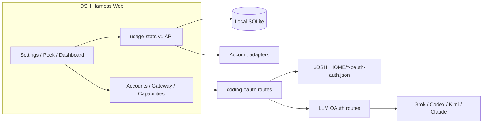

<!-- banner -->
<div align="center">

# dsh-hub-oauth-gateway

**v1.9.0** · anteriormente `dsh-usage-stats`

**Centro de uso local-first para [DeepSeek Harness](https://github.com/deepseek-ai/dsh) Web.** Tokens, custo estimado, saldos de conta, cotas de assinatura, tendências, previsões, alertas e exportações — além de OAuth de assinaturas de coding (Grok Build, Codex, Kimi Code, Claude Code), um gateway de API loopback opcional e monitoramento local opt-in de auth/uso. **Não cole tokens no chat.**

[](https://github.com/lninghaha/dsh-hub-oauth-gateway/actions/workflows/ci.yml)
[](LICENSE)
[](.github/CONTRIBUTING.md)

*[English](README.md) · [中文版](README.zh-CN.md) · [日本語](README.ja.md) · [한국어](README.ko.md) · [Português (BR)](README.pt-BR.md) · [Español](README.es.md) · [Français](README.fr.md) · [Deutsch](README.de.md) · [Русский](README.ru.md)*

</div>

---

> **Upgrade / 升级：** Follow the versioned steps in [`docs/01-install.md`](docs/01-install.md). Install into the existing `web` profile, keep profile/config/credential files, and restart one existing DSH Web process after all packages are updated. When Hub and Subscription are both used, `dsh-coding-oauth-core@0.1.0` is their shared npm dependency, not a separate DSH plugin.

---

## Mudança de nome

Publicado inicialmente como **`dsh-usage-stats`**. O pacote e o repositório agora são **`dsh-hub-oauth-gateway`** (a partir de **1.1.0**). Remova qualquer entrada antiga antes de reinstalar. Arquivos de dados locais e o id interno do plugin Cordis permanecem iguais, preservando o histórico de uso.

| | Use isto | Ainda funciona / inalterado |
|---|---|---|
| npm (recomendado) | `dsh plugin --profile web add dsh-hub-oauth-gateway` | O nome npm antigo não é mais atualizado |
| GitHub / desenvolvimento | [`dsh-hub-oauth-gateway`](https://github.com/lninghaha/dsh-hub-oauth-gateway) | — |
| id do plugin Cordis | `usage-stats` | inalterado |
| banco SQLite | `${DSH_HOME}/storages/usage-stats-v1.sqlite` | inalterado |
| CLI | `dsh-coding-oauth` | `dsh-grok-build` (alias) |

Histórico de releases em [`CHANGELOG.md`](CHANGELOG.md).

## Recursos

- **Quick Peek + Full Dashboard** — HUD flutuante (ou botão na barra lateral); abas overview / trends / accounts / details / local; today / 7d / 30d / month; comparar período anterior; atualização manual.
- **Configurações em abas** — Display / Accounts / Gateway / Capabilities / Providers / Fees em Settings → Usage Center.
- **Presets e módulos** — Minimal, Quota, Cost, Analyst; ordem customizada de módulos; densidade, motion, aliases e cores de providers.
- **Mapa de calor de atividade** — calendário de 370 dias + streak no fuso configurado.
- **Histórico local** — projeta uso do DSH no SQLite por `(session, turn, step)`; amostras posteriores substituem, nunca contam em dobro.
- **Estimativas de custo** — preços por milhão definidos pelo usuário com taxa de cobertura; preços ausentes nunca são tratados como grátis.
- **Ledger de taxas de assinatura** — custos locais de assinatura/recarga; múltiplos de payback quando as moedas coincidem.
- **Tendências e previsões** — buckets hora/dia/semana/mês; extrapolação linear limitada como série distinta.
- **Adaptadores de conta e cota** — saldos, janelas, horários de reset, stale/last-success, alertas suaves (sem bloqueios rígidos, sem notificação externa).
- **Exportação CSV / JSON** — layouts filtrados, diários ou bundle; redação opcional de sessão; defesa contra injeção em planilhas.
- **OAuth de assinaturas de coding** — Grok Build, Codex, Kimi Code, Claude Code via device code / browser / colagem PKCE; modelos aparecem como `(OAuth)`; Pull unidirecional de credenciais CLI.
- **Gateway de API loopback opcional** — servidor compatível OpenAI/Anthropic desligado por padrão para suas próprias ferramentas.
- **Capacidades opcionais** — Codex search / images / usage / Fast e Grok Imagine desligados por padrão; aplicam ao vivo.
- **Monitor local opt-in** — snapshots read-only de auth CLI e varreduras cross-tool de tokens (nunca conteúdo de conversa).
- **UI bilíngue** — chinês e inglês via serviços de locale do DSH.

Pesquisa de produto: [`docs/research/usage-analytics-landscape.md`](docs/research/usage-analytics-landscape.md). Arquitetura: [`docs/02-architecture.md`](docs/02-architecture.md).

## Capturas de tela

Capturado no DeepSeek Harness Web com este plugin instalado (histórico local vazio é normal em um profile isolado novo).

<p align="center">
  
  <br />
  <em>HUD flutuante — métrica de hoje e chips de cota multi-conta</em>
</p>

<p align="center">
  
  <br />
  <em>Quick Peek — KPIs só locais, com atalho para o dashboard completo</em>
</p>

<p align="center">
  
  <br />
  <em>Dashboard completo — intervalos, abas, atualização e exportação CSV / JSON</em>
</p>

<p align="center">
  
  <br />
  <em>Configurações → Usage Center — Exibição / Contas / Gateway / Capacidades / Provedores / Taxas</em>
</p>

## Problemas que este plugin resolve

| Você buscou / viu | O que estava quebrado | O que este plugin faz |
|---|---|---|
| Uso / custo / cota espalhados entre CLIs e providers | Sem histórico local único ou visão de custo com cobertura | Projeção SQLite + regras de preço + adaptadores de conta no Usage Center |
| SuperGrok / ChatGPT Plus / Kimi Code / Claude Pro no DSH sem outra conta de API | Rotas built-in costumam ser pay-as-you-go com API keys | Rotas OAuth locais coexistem com providers API-key existentes |
| `本轮运行失败` **API key is invalid** / `AUTH` no meio do turn | A GUI mapeia todo `AUTH` para esse banner; access tokens OAuth expiram | Refresh proativo e retry ciente de AUTH nas rotas coding OAuth |
| Quer ferramentas compatíveis OpenAI/Anthropic contra sessões de assinatura | Sem ponte local segura | Gateway loopback opt-in (não é relay público) |
| Status CLI estilo Token Monitor sem colar segredos | Escavação manual de arquivos ou colar no chat | localMonitor / localUsage opt-in em caminhos allowlisted hardened |

## Início rápido

```bash
# 1. install the current npm release into the web profile
dsh plugin --profile web add dsh-hub-oauth-gateway

# 2. restart the resident DSH Web process (operator chooses when)
# Local service-manager example only; `dsh web` is the official CLI alias for the web profile.
systemctl --user restart dsh-web.service
# `dsh-web.service` é apenas um nome local de exemplo; outras implantações podem usar outro gerenciador.
```

Depois abra **Settings → Usage Center**. Para Accounts / Gateway / Capabilities, faça login ou habilite switches conforme necessário. Opções completas de instalação (instalador npx, tarball GitHub, proxy) em [`docs/01-install.md`](docs/01-install.md).

## Índice

- [Mudança de nome](#mudança-de-nome)
- [Recursos](#recursos)
- [Capturas de tela](#capturas-de-tela)
- [Problemas que este plugin resolve](#problemas-que-este-plugin-resolve)
- [Início rápido](#início-rápido)
- [Requisitos](#requisitos)
- [Instalação](#instalação)
- [Uso](#uso)
- [Configurações](#configurações)
- [Coding OAuth](#coding-oauth)
- [Gateway de API local](#gateway-de-api-local)
- [Capacidades opcionais](#capacidades-opcionais)
- [Configuração de runtime](#configuração-de-runtime)
- [Credenciais](#credenciais)
- [Dados e migração](#dados-e-migração)
- [Privacidade e segurança](#privacidade-e-segurança)
- [Arquitetura](#arquitetura)
- [Documentação](#documentação)
- [Contribuição](#contribuição)
- [Licença](#licença)

## Requisitos

- DeepSeek Harness Web, verificado com `@deepseek-ai/dsh 0.1.0-rc.6`
- Node.js `^22.19.0 || >=24.0.0`
- Backend DSH Web em loopback; proxy reverso HTTPS local controlado para rede privada autenticada é OK. Não exponha só a API do plugin nem publique sem autenticação na internet pública.

## Instalação

```bash
dsh plugin --profile web add dsh-hub-oauth-gateway
dsh plugin --profile web update dsh-hub-oauth-gateway
dsh plugin --profile web remove dsh-hub-oauth-gateway
```

Instalador compatível quando o gerenciador de plugins falta: `npx --yes dsh-hub-oauth-gateway-install`. Instalações GitHub `/path/to/*.tgz` e de desenvolvimento documentadas em [`docs/01-install.md`](docs/01-install.md). Após instalar, reinicie o processo DSH Web existente pelo seu próprio gerenciador de serviços (a unidade `systemctl` abaixo é apenas um exemplo local), depois atualize `http://127.0.0.1:3080`.

## Uso

1. Abra Quick Peek pelo HUD flutuante (ou botão na barra lateral em **Settings → Display → entry mode**). Configurações também linkam Peek / Full Dashboard.
2. No Full Dashboard, alterne overview / trends / accounts / details / local; escolha range, metric e dimensões provider/model.
3. Use o botão de refresh para projeção imediata e refresh de contas. GET comum lê apenas snapshots locais.
4. Configure Display / Accounts / Gateway / Capabilities / Providers / Fees em **Settings → Usage Center**.
5. Custos são sempre estimativas — observe a porcentagem de cobertura; tokens sem preço não são grátis.

CLI: `dsh-coding-oauth login [--pkce] | import | status | logout` (`dsh-grok-build` é alias).

## Configurações

**Settings → Usage Center** usa seis abas superiores: **Display**, **Accounts**, **Gateway**, **Capabilities**, **Providers** e **Fees**. Cards de providers logados ficam recolhidos até expandir. Cada card de Providers mantém sua auth inline — salvar/limpar API Key, auth device Copilot, atualização por provider — e cards OAuth levam direto ao login / pull de Accounts.

## Coding OAuth

Na aba **Accounts**, faça login em Grok Build, Codex, Kimi Code ou Claude Code (device code preferido em hosts remotos/headless; browser/PKCE pode colar código ou URL de redirect completa). Modelos autenticados aparecem no seletor com `(OAuth)`.

Arquivos OAuth oficiais de CLI na allowlist são descobertos read-only. Sync é **Pull** unidirecional explícito (discover → preview → confirm), nunca import automático e nunca escreve arquivos oficiais de CLI.

## Gateway de API local

**Desligado** por padrão. Quando habilitado, um listener `node:http` isolado (não a porta web do DSH) serve `GET /healthz`, `GET /v1/models`, `POST /v1/chat/completions`, `POST /v1/responses` e `POST /v1/messages` em loopback, reutilizando sessões OAuth logadas. bind só via YAML; bind não-loopback exige Bearer key. Não é relay remoto. Detalhes: [`docs/01-install.md`](docs/01-install.md).

## Capacidades opcionais

Sete switches **desligados** por padrão e aplicam **live**: `codexSearch`, `codexImages`, `codexImageEdits`, `codexUsage`, `codexFast`, `grokImagineImage`, `grokImagineVideo`. Codex Fast / endpoints privados e Grok Imagine permanecem fail-closed até habilitados. Veja [`docs/01-install.md`](docs/01-install.md) e [`docs/03-configuration.md`](docs/03-configuration.md).

## Configuração de runtime

Mescle `config` na entry Cordis existente — não adicione uma segunda entry:

```yaml
# ~/.dsh/profiles/web/cordis.patch.yml
- insert:
    - id: usage-stats
      name: dsh-hub-oauth-gateway
      config:
        refresh:
          usageSeconds: 30
          accountMinutes: 5
          accountConcurrency: 3
          timeoutMs: 15000
        retention:
          usageDays: 730
          accountSnapshotDays: 180
          preserveDeletedSessions: true
        pricing:
          baseCurrency: USD
        accounts:
          monitors: {}
        oauthDevice:
          copilotClientId: YOUR_PUBLIC_OAUTH_CLIENT_ID
        codingOAuth:
          enabled: true
        localMonitor:
          enabled: false
        localUsage:
          enabled: false
          intervalMinutes: 30
```

Referência completa de campos, monitors, proxy e import de pricing: [`docs/03-configuration.md`](docs/03-configuration.md) e [`docs/01-install.md`](docs/01-install.md). `config.monitors` legado na raiz mapeia para `config.accounts.monitors` (não configure ambos).

## Credenciais

- Armazenadas via DSH credential seam; o browser recebe apenas metadados `configured` / `source` / `writable` — nunca valores.
- Import CLI local (Claude, Codex, Gemini, Grok, Amp) nunca registra caminhos absolutos.
- Fluxo device Copilot mantém device code no servidor; o browser guarda apenas um flow ID aleatório. Configure seu próprio public OAuth client ID antes de habilitar.
- Arquivos Coding OAuth: `$DSH_HOME/.grok-build-auth.json` e outros `*-oauth-auth.json` (`0600`, escrita atômica). **Nenhum status HTTP, log ou UI pode retornar um token.**

## Dados e migração

```text
${DSH_HOME:-~/.dsh}/storages/usage-stats-v1.sqlite
```

Diretório `0700`, arquivo principal `0600`, WAL. Retenção padrão: 730 dias de usage facts, 180 dias de snapshots de conta. Migração na primeira inicialização e notas de rollback: [`docs/04-migration-v1.md`](docs/04-migration-v1.md).

## Privacidade e segurança

- Loopback peer + loopback Host; corpos de escrita JSON; regras same-origin / forwarded-host para proxies reversos (`x-dsh-hub-oauth-gateway: 1`).
- GET comum é só local; refresh com credenciais é POST explícito ou agendado.
- Monitors: HTTPS por padrão, sem credenciais embutidas na URL, redirects manuais, limites de tamanho, DNS pinning antes de conectar.
- SQLite exclui credenciais, prompts, responses, cwd e payloads brutos de providers.
- Analytics e estimativas não são faturas. Consulte apenas contas e endpoints que você possui ou está autorizado a usar.

Modelo de ameaça e reporte: [`.github/SECURITY.md`](.github/SECURITY.md).

## Arquitetura



Detalhes: [`docs/02-architecture.md`](docs/02-architecture.md) · [中文](docs/02-architecture.zh-CN.md). Atribuição OAuth: [`docs/oauth-provenance.md`](docs/oauth-provenance.md).

## Documentação

| Doc | Propósito |
|---|---|
| [`docs/01-install.md`](docs/01-install.md) | Instalação, proxy, gateway, capabilities, troubleshooting |
| [`CHANGELOG.md`](CHANGELOG.md) | Histórico de releases |
| [`docs/00-project-rules.md`](docs/00-project-rules.md) | Camadas de publicação, versionamento, loop de release |
| [`docs/02-architecture.md`](docs/02-architecture.md) | Arquitetura interna · [中文](docs/02-architecture.zh-CN.md) |
| [`docs/03-configuration.md`](docs/03-configuration.md) | Referência de configuração de runtime |
| [`docs/04-migration-v1.md`](docs/04-migration-v1.md) | Migração de dados 1.0 |
| [`.github/CONTRIBUTING.md`](.github/CONTRIBUTING.md) | Guia de contribuição |
| [`.github/SECURITY.md`](.github/SECURITY.md) | Política de segurança |

## Contribuição

Verifique no Cursor Cloud / workspace em nuvem deste repositório com Node.js e pnpm declarados (Docker sandbox é opcional, não obrigatório). Use `DSH_HOME` isolado para smoke tests do DSH. Veja [`.github/CONTRIBUTING.md`](.github/CONTRIBUTING.md). Mantenha segredos, prompts e caminhos pessoais fora de issues, PRs, screenshots e logs.

Se seu idioma faltar no seletor, abra um PR com tradução do README e adicionaremos.

## Licença

[MIT](LICENSE) · veja [NOTICE](NOTICE). Projeto comunitário independente; nenhum endosso de fornecedor é implícito. Partes Coding-OAuth mantêm atribuição Apache-2.0 onde exigido (`LICENSES/Apache-2.0.txt`).
