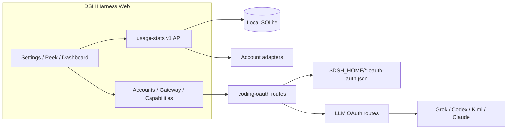

<!-- banner -->
<div align="center">

# dsh-hub-oauth-gateway

**v1.8.0** · ранее `dsh-usage-stats`

**Локальный центр учёта использования для [DeepSeek Harness](https://github.com/deepseek-ai/dsh) Web.** Токены, оценочная стоимость, балансы аккаунтов, квоты подписок, тренды, прогнозы, оповещения и экспорт — плюс OAuth для coding-подписок (Grok Build, Codex, Kimi Code, Claude Code), опциональный loopback API-шлюз и опциональный локальный мониторинг auth/usage. **Не вставляйте токены в чат.**

[](https://github.com/lninghaha/dsh-hub-oauth-gateway/actions/workflows/ci.yml)
[](LICENSE)
[](.github/CONTRIBUTING.md)

*[English](README.md) · [中文版](README.zh-CN.md) · [日本語](README.ja.md) · [한국어](README.ko.md) · [Português (BR)](README.pt-BR.md) · [Español](README.es.md) · [Français](README.fr.md) · [Deutsch](README.de.md) · [Русский](README.ru.md)*

</div>

---

## Переименование

Изначально опубликован как **`dsh-usage-stats`**. Пакет и репозиторий теперь называются **`dsh-hub-oauth-gateway`** (начиная с **1.1.0**). Перед повторной установкой удалите старую запись. Локальные файлы данных и внутренний id плагина Cordis остаются прежними, поэтому история использования сохраняется.

| | Используйте это | По-прежнему работает / без изменений |
|---|---|---|
| npm (рекомендуется) | `dsh plugin --profile web add dsh-hub-oauth-gateway` | Старое имя npm больше не обновляется |
| GitHub / разработка | [`dsh-hub-oauth-gateway`](https://github.com/lninghaha/dsh-hub-oauth-gateway) | — |
| id плагина Cordis | `usage-stats` | без изменений |
| база SQLite | `${DSH_HOME}/storages/usage-stats-v1.sqlite` | без изменений |
| CLI | `dsh-coding-oauth` | `dsh-grok-build` (алиас) |

История релизов — в [`CHANGELOG.md`](CHANGELOG.md).

## Возможности

- **Quick Peek + Full Dashboard** — плавающий HUD (или кнопка на боковой панели); вкладки overview / trends / accounts / details / local; today / 7d / 30d / month; сравнение с предыдущим периодом; ручное обновление.
- **Вкладки настроек** — Display / Accounts / Gateway / Capabilities / Providers / Fees в Settings → Usage Center.
- **Пресеты и модули** — Minimal, Quota, Cost, Analyst; пользовательский порядок модулей; плотность, анимация, алиасы и цвета провайдеров.
- **Тепловая карта активности** — календарь на 370 дней + streak в настроенном часовом поясе.
- **Локальная история** — проецирует usage DSH в SQLite по `(session, turn, step)`; более поздние сэмплы заменяют предыдущие, двойного подсчёта нет.
- **Оценка стоимости** — цены за миллион токенов, заданные пользователем, с коэффициентом покрытия; отсутствующие цены никогда не считаются бесплатными.
- **Учёт подписок** — локальные расходы на подписку/пополнение; кратность окупаемости при совпадении валют.
- **Тренды и прогнозы** — агрегация по hour/day/week/month; ограниченная линейная экстраполяция как отдельный ряд.
- **Адаптеры аккаунтов и квот** — балансы, окна, время сброса, stale/last-success, мягкие оповещения (без жёсткой блокировки и исходящих уведомлений).
- **Экспорт CSV / JSON** — фильтрованный, дневной или bundle-формат; опциональное редактирование session; защита от injection в электронные таблицы.
- **OAuth coding-подписок** — Grok Build, Codex, Kimi Code, Claude Code через device code / browser / PKCE paste; модели отображаются как `(OAuth)`; односторонний Pull учётных данных CLI.
- **Опциональный loopback API-шлюз** — по умолчанию выключен OpenAI/Anthropic-совместимый сервер для ваших инструментов.
- **Опциональные возможности** — Codex search / images / usage / Fast и Grok Imagine по умолчанию выключены; применяются сразу.
- **Опциональный локальный монитор** — снимки auth CLI только для чтения и сканирование токенов между инструментами (никогда не содержимое разговоров).
- **Двуязычный UI** — китайский и английский через сервисы locale DSH.

Исследование продукта: [`docs/research/usage-analytics-landscape.md`](docs/research/usage-analytics-landscape.md). Архитектура: [`docs/02-architecture.md`](docs/02-architecture.md).

## Скриншоты

Снято в DeepSeek Harness Web с установленным плагином (пустая локальная история нормальна для нового изолированного profile).

<p align="center">
  
  <br />
  <em>Плавающий HUD — метрика за сегодня и чипы квот по аккаунтам</em>
</p>

<p align="center">
  
  <br />
  <em>Quick Peek — только локальные KPI, с переходом к полной панели</em>
</p>

<p align="center">
  
  <br />
  <em>Полная панель — диапазоны, вкладки, обновление и экспорт CSV / JSON</em>
</p>

<p align="center">
  
  <br />
  <em>Настройки → Usage Center — Отображение / Аккаунты / Шлюз / Возможности / Провайдеры / Расходы</em>
</p>

## Какие проблемы решает плагин

| Вы искали / видели | Что на самом деле было сломано | Что делает этот плагин |
|---|---|---|
| Usage / cost / quota разбросаны по CLI и провайдерам | Нет единой локальной истории и cost view с учётом покрытия | Проекция SQLite + правила цен + адаптеры аккаунтов в одном Usage Center |
| SuperGrok / ChatGPT Plus / Kimi Code / Claude Pro в DSH без отдельного API-счёта | Встроенные маршруты часто используют pay-as-you-go API keys | Локальные OAuth-маршруты сосуществуют с существующими API-key провайдерами |
| `本轮运行失败` **API key is invalid** / `AUTH` посреди turn | GUI отображает каждый `AUTH` этим баннером; OAuth access tokens истекают | Проактивное обновление и AUTH-aware retry на coding OAuth маршрутах |
| Нужны OpenAI/Anthropic-совместимые инструменты для subscription-сессий | Нет безопасного локального моста | Опциональный loopback-шлюз (не публичный relay) |
| Статус CLI в стиле Token Monitor без вставки секретов | Ручной просмотр файлов или вставка в чат | Опциональные localMonitor / localUsage на жёстко заданных allowlisted путях |

## Быстрый старт

```bash
# 1. установить текущий npm-релиз в web profile
dsh plugin --profile web add dsh-hub-oauth-gateway

# 2. перезапустить резидентный сервис dsh web (оператор выбирает момент)
systemctl --user restart dsh-web.service
# или: dsh-web restart
```

Затем откройте **Settings → Usage Center**. Для Accounts / Gateway / Capabilities войдите или включите переключатели по необходимости. Полные варианты установки (npx installer, GitHub tarball, proxy) — в [`docs/01-install.md`](docs/01-install.md).

## Содержание

- [Переименование](#переименование)
- [Возможности](#возможности)
- [Скриншоты](#скриншоты)
- [Какие проблемы решает плагин](#какие-проблемы-решает-плагин)
- [Быстрый старт](#быстрый-старт)
- [Требования](#требования)
- [Установка](#установка)
- [Использование](#использование)
- [Настройки](#настройки)
- [Coding OAuth](#coding-oauth)
- [Локальный API-шлюз](#локальный-api-шлюз)
- [Дополнительные возможности](#дополнительные-возможности)
- [Конфигурация во время выполнения](#конфигурация-во-время-выполнения)
- [Учётные данные](#учётные-данные)
- [Данные и миграция](#данные-и-миграция)
- [Конфиденциальность и безопасность](#конфиденциальность-и-безопасность)
- [Архитектура](#архитектура)
- [Документация](#документация)
- [Участие в разработке](#участие-в-разработке)
- [Лицензия](#лицензия)

## Требования

- DeepSeek Harness Web, проверено с `@deepseek-ai/dsh 0.1.0-rc.6`
- Node.js `^22.19.0 || >=24.0.0`
- Loopback backend DSH Web; допустим контролируемый локальный HTTPS reverse proxy к аутентифицированной частной сети. Не выставляйте API плагина отдельно и не публикуйте без аутентификации в публичный интернет.

## Установка

```bash
dsh plugin --profile web add dsh-hub-oauth-gateway
dsh plugin --profile web update dsh-hub-oauth-gateway
dsh plugin --profile web remove dsh-hub-oauth-gateway
```

Совместимый установщик при отсутствии plugin manager: `npx --yes dsh-hub-oauth-gateway-install`. Установка из GitHub `/path/to/*.tgz` и development path описана в [`docs/01-install.md`](docs/01-install.md). После установки перезапустите Web самостоятельно (`dsh-web restart` или `systemctl --user restart dsh-web.service`), затем обновите `http://127.0.0.1:3080`.

## Использование

1. Откройте Quick Peek из плавающего HUD (или кнопки на боковой панели в **Settings → Display → entry mode**). Настройки также ведут к Peek / Full Dashboard.
2. В Full Dashboard переключайте overview / trends / accounts / details / local; выбирайте диапазон, метрику и измерения provider/model.
3. Кнопка refresh выполняет немедленную проекцию и обновление аккаунтов. Обычный GET читает только локальные снимки.
4. Настройте Display / Accounts / Gateway / Capabilities / Providers / Fees в **Settings → Usage Center**.
5. Стоимость всегда является оценкой — следите за процентом покрытия; неоценённые токены не бесплатны.

CLI: `dsh-coding-oauth login [--pkce] | import | status | logout` (`dsh-grok-build` — алиас).

## Настройки

**Settings → Usage Center** использует шесть верхних вкладок: **Display**, **Accounts**, **Gateway**, **Capabilities**, **Providers** и **Fees**. Карточки вошедших провайдеров свёрнуты до раскрытия. Каждая карточка Providers управляет своей аутентификацией — сохранение/удаление API Key, device auth Copilot, обновление по провайдеру — а OAuth-карточки ведут прямо к входу/импорту в Accounts.

## Coding OAuth

На вкладке **Accounts** войдите в Grok Build, Codex, Kimi Code или Claude Code (device code предпочтителен на remote/headless хостах; browser/PKCE может вставить код или полный redirect URL). Аутентифицированные модели появляются в селекторе с `(OAuth)`.

Allowlisted официальные CLI OAuth-файлы обнаруживаются только для чтения. Синхронизация — явный односторонний **Pull** (discover → preview → confirm), никогда auto-import и никогда не записывает официальные CLI-файлы.

## Локальный API-шлюз

По умолчанию **выключен**. При включении изолированный `node:http` listener (не порт DSH web) обслуживает `GET /healthz`, `GET /v1/models`, `POST /v1/chat/completions`, `POST /v1/responses` и `POST /v1/messages` на loopback, переиспользуя вошедшие OAuth-сессии. Bind только через YAML; non-loopback bind требует Bearer key. Это не remote relay. Подробности: [`docs/01-install.md`](docs/01-install.md).

## Дополнительные возможности

Семь переключателей по умолчанию **выключены** и применяются **сразу**: `codexSearch`, `codexImages`, `codexImageEdits`, `codexUsage`, `codexFast`, `grokImagineImage`, `grokImagineVideo`. Codex Fast / private endpoints и Grok Imagine остаются fail-closed до включения. См. [`docs/01-install.md`](docs/01-install.md) и [`docs/03-configuration.md`](docs/03-configuration.md).

## Конфигурация во время выполнения

Объедините `config` в существующей записи Cordis — не добавляйте вторую:

```yaml
# ~/.dsh/profiles/web/cordis.patch.yml
- insert:
    - id: usage-stats
      name: dsh-hub-oauth-gateway
      config:
        refresh:
          usageSeconds: 30
          accountMinutes: 5
          accountConcurrency: 3
          timeoutMs: 15000
        retention:
          usageDays: 730
          accountSnapshotDays: 180
          preserveDeletedSessions: true
        pricing:
          baseCurrency: USD
        accounts:
          monitors: {}
        oauthDevice:
          copilotClientId: YOUR_PUBLIC_OAUTH_CLIENT_ID
        codingOAuth:
          enabled: true
        localMonitor:
          enabled: false
        localUsage:
          enabled: false
          intervalMinutes: 30
```

Полный справочник полей, monitors, proxy и импорт pricing: [`docs/03-configuration.md`](docs/03-configuration.md) и [`docs/01-install.md`](docs/01-install.md). Устаревший корневой `config.monitors` отображается в `config.accounts.monitors` (не задавайте оба).

## Учётные данные

- Хранятся через DSH credential seam; браузер получает только метаданные `configured` / `source` / `writable` — никогда значения.
- Локальный импорт CLI (Claude, Codex, Gemini, Grok, Amp) никогда не логирует абсолютные пути.
- Copilot device flow держит device code на сервере; браузер хранит только случайный flow ID. Настройте свой public OAuth client ID перед включением.
- Coding OAuth файлы: `$DSH_HOME/.grok-build-auth.json` и другие `*-oauth-auth.json` (`0600`, atomic write). **Ни HTTP status, ни log, ни UI не должны возвращать token.**

## Данные и миграция

```text
${DSH_HOME:-~/.dsh}/storages/usage-stats-v1.sqlite
```

Каталог `0700`, основной файл `0600`, WAL. Хранение по умолчанию: 730 дней usage facts, 180 дней account snapshots. Миграция при первом запуске и откат: [`docs/04-migration-v1.md`](docs/04-migration-v1.md).

## Конфиденциальность и безопасность

- Loopback peer + loopback Host; JSON write bodies; same-origin / forwarded-host rules для reverse proxies (`x-dsh-hub-oauth-gateway: 1`).
- Обычный GET только локально; refresh с учётными данными — явный POST или по расписанию.
- Monitors: HTTPS по умолчанию, без credentials в URL, manual redirects, лимиты размера, DNS pinning перед connect.
- SQLite не содержит credentials, prompts, responses, cwd и raw provider payloads.
- Аналитика и оценки — не счета. Запрашивайте только аккаунты и endpoints, которыми вы владеете или на использование которых уполномочены.

Модель угроз и отчёты: [`.github/SECURITY.md`](.github/SECURITY.md).

## Архитектура



Подробности: [`docs/02-architecture.md`](docs/02-architecture.md) · [中文](docs/02-architecture.zh-CN.md). OAuth attribution: [`docs/oauth-provenance.md`](docs/oauth-provenance.md).

## Документация

| Документ | Назначение |
|---|---|
| [`docs/01-install.md`](docs/01-install.md) | Установка, proxy, gateway, capabilities, troubleshooting |
| [`CHANGELOG.md`](CHANGELOG.md) | История релизов |
| [`docs/00-project-rules.md`](docs/00-project-rules.md) | Слои публикации, версионирование, цикл релиза |
| [`docs/02-architecture.md`](docs/02-architecture.md) | Внутренняя архитектура · [中文](docs/02-architecture.zh-CN.md) |
| [`docs/03-configuration.md`](docs/03-configuration.md) | Справочник конфигурации |
| [`docs/04-migration-v1.md`](docs/04-migration-v1.md) | Миграция данных 1.0 |
| [`.github/CONTRIBUTING.md`](.github/CONTRIBUTING.md) | Руководство по участию |
| [`.github/SECURITY.md`](.github/SECURITY.md) | Политика безопасности |

## Участие в разработке

Проверяйте в Cursor Cloud / cloud workspace этого репозитория с заявленными Node.js и pnpm (Docker sandbox опционален, не обязателен). Для DSH smoke tests используйте изолированный `DSH_HOME`. См. [`.github/CONTRIBUTING.md`](.github/CONTRIBUTING.md). Не включайте секреты, prompts и личные пути в issues, PR, скриншоты и логи.

Если вашего языка нет в переключателе, откройте PR с переводом README — мы добавим его.

## Лицензия

[MIT](LICENSE) · см. [NOTICE](NOTICE). Независимый community-проект; endorsement поставщика не подразумевается. Части Coding-OAuth сохраняют Apache-2.0 attribution там, где требуется (`LICENSES/Apache-2.0.txt`).
