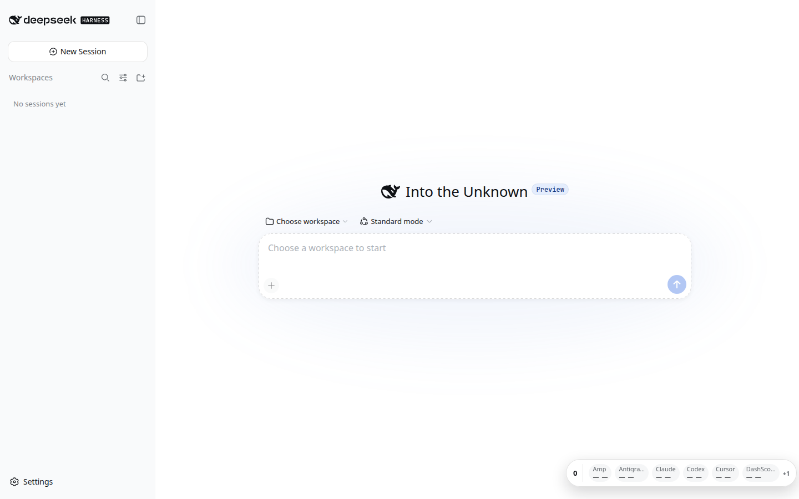
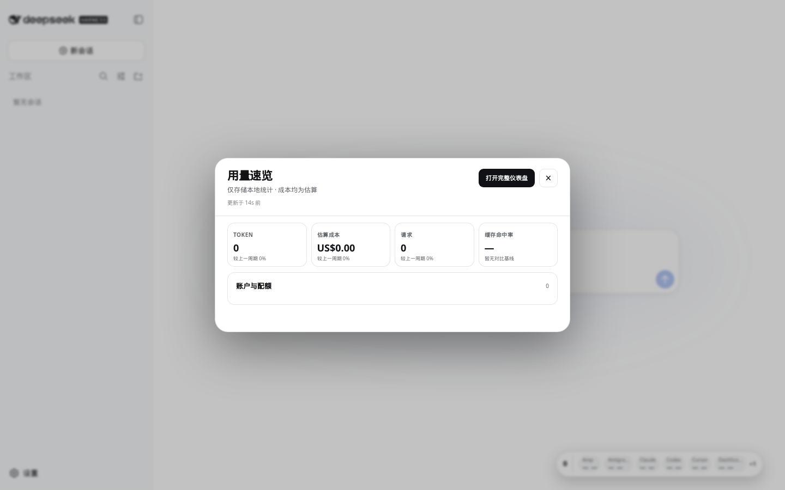
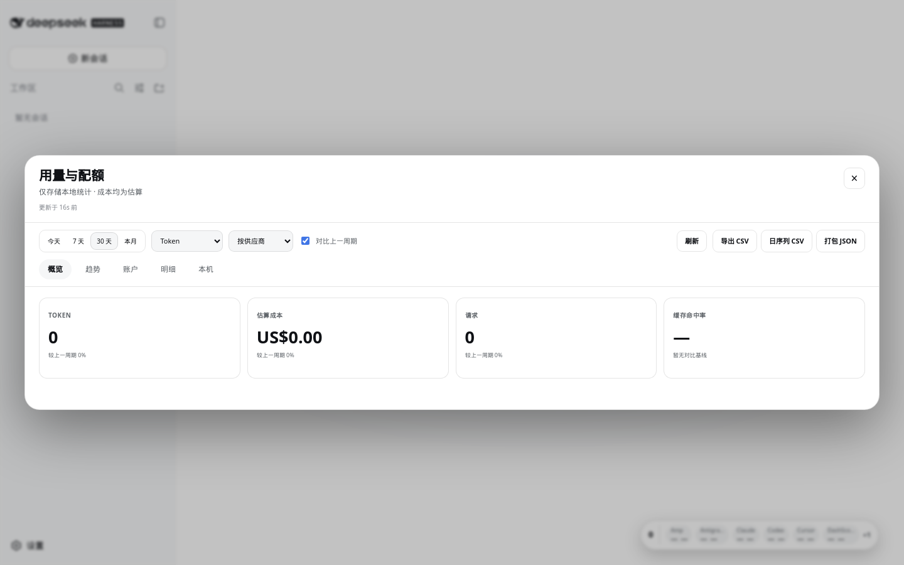
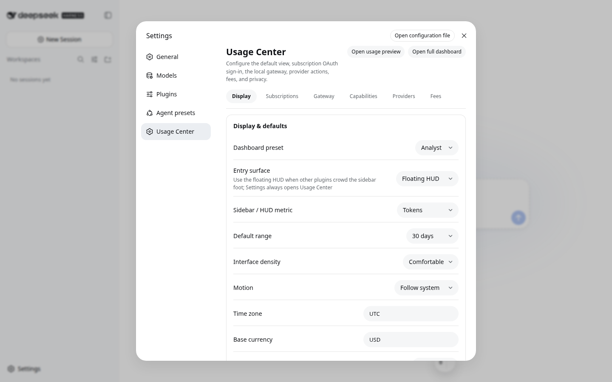
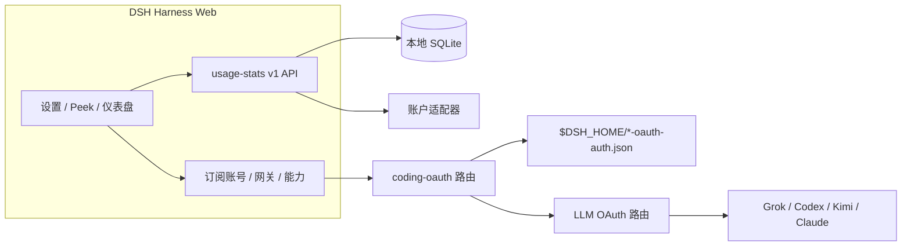

<!-- banner -->
<div align="center">

# dsh-hub-oauth-gateway

**v1.8.0** · 原名 `dsh-usage-stats`

**面向 [DeepSeek Harness](https://github.com/deepseek-ai/dsh) Web 的本地优先用量中心。** Token、估算成本、账户余额、订阅配额、趋势、预测、提醒与导出——外加编码订阅 OAuth（Grok Build、Codex、Kimi Code、Claude Code）、可选回环 API 网关，以及可选的本机认证/用量监控。**不要把 token 粘贴进聊天。**

[](https://github.com/lninghaha/dsh-hub-oauth-gateway/actions/workflows/ci.yml)
[](LICENSE)
[](.github/CONTRIBUTING.md)

*[English](README.md) · [中文版](README.zh-CN.md) · [日本語](README.ja.md) · [한국어](README.ko.md) · [Português (BR)](README.pt-BR.md) · [Español](README.es.md) · [Français](README.fr.md) · [Deutsch](README.de.md) · [Русский](README.ru.md)*

</div>

---

## 项目更名

最初发布名为 **`dsh-usage-stats`**。自 **1.1.0** 起包名与仓库为 **`dsh-hub-oauth-gateway`**。请先移除旧 entry 再重新安装。本地数据文件与内部 Cordis 插件 id 不变，历史统计得以保留。

| | 请用这个 | 仍然可用 / 不变 |
|---|---|---|
| npm（推荐） | `dsh plugin --profile web add dsh-hub-oauth-gateway` | 旧 npm 包名不再更新 |
| GitHub / 开发 | [`dsh-hub-oauth-gateway`](https://github.com/lninghaha/dsh-hub-oauth-gateway) | — |
| Cordis 插件 id | `usage-stats` | 不变 |
| SQLite 数据库 | `${DSH_HOME}/storages/usage-stats-v1.sqlite` | 不变 |
| CLI | `dsh-coding-oauth` | `dsh-grok-build`（别名） |

版本历史见 [`CHANGELOG.md`](CHANGELOG.md)。

## 特性

- **Quick Peek + Full Dashboard** —— 悬浮小窗（或侧栏按钮）；概览 / 趋势 / 账户 / 明细 / 本机页签；today / 7d / 30d / month；上一周期对比；手动刷新。
- **分栏设置** —— Settings → 用量中心：显示 / 订阅账号 / 网关 / 能力 / 供应商 / 费用。
- **预设与模块编排** —— Minimal、Quota、Cost、Analyst；自定义模块顺序；密度、动效、供应商别名与颜色。
- **活动热力图** —— 配置时区下 370 天日历 + streak。
- **本地历史** —— 按 `(session, turn, step)` 投影到 SQLite；后写覆盖，不累计放大。
- **成本估算** —— 用户维护的每百万 Token 价格与覆盖率；缺失价格绝不当作免费。
- **订阅费用账本** —— 本地订阅/充值；货币一致时可显示回本倍数。
- **趋势与预测** —— 小时/日/周/月桶；有界线性外推为独立序列。
- **账户与配额适配器** —— 余额、窗口、重置时间、陈旧/上次成功、软提醒（无硬阻断、不外发通知）。
- **CSV / JSON 导出** —— 过滤、日序列或打包；可选会话脱敏；电子表格公式注入防护。
- **编码订阅 OAuth** —— Grok Build、Codex、Kimi Code、Claude Code（设备码 / 浏览器 / PKCE 粘贴）；模型标注 `(OAuth)`；单向 CLI 凭据拉取。
- **可选回环 API 网关** —— 默认关闭的 OpenAI/Anthropic 兼容服务，仅供本机工具。
- **可选能力** —— Codex 搜索 / 图像 / 用量 / Fast 与 Grok Imagine 默认关闭，打开后立即生效。
- **可选本机监控** —— 只读 CLI 认证快照与跨工具 Token 扫描（从不读取对话内容）。
- **中英文界面** —— 复用 DSH locale 服务。

产品调研：[`docs/research/usage-analytics-landscape.md`](docs/research/usage-analytics-landscape.md)。架构：[`docs/02-architecture.md`](docs/02-architecture.md)。

## 产品截图

在 DeepSeek Harness Web 安装本插件后截取（全新隔离 profile 下本地历史为空属正常）。

<p align="center">
  
  <br />
  <em>悬浮 HUD —— 今日指标与多账户配额芯片</em>
</p>

<p align="center">
  
  <br />
  <em>用量速览 —— 紧凑 2×2 KPI，一键进入完整仪表盘</em>
</p>

<p align="center">
  
  <br />
  <em>完整仪表盘 —— 时间范围、页签、刷新与 CSV / JSON 导出</em>
</p>

<p align="center">
  
  <br />
  <em>设置 → 用量中心 —— 显示 / 订阅账号 / 网关 / 能力 / 供应商 / 费用</em>
</p>

## 本插件解决的问题

| 你搜到 / 看到的 | 实际坏在哪 | 本插件怎么处理 |
|---|---|---|
| 用量 / 成本 / 配额散落在各 CLI 与供应商 | 没有统一的本地历史与带覆盖率的成本视图 | SQLite 投影 + 价格规则 + 账户适配器，集中在用量中心 |
| 想在 DSH 用 SuperGrok / ChatGPT Plus / Kimi Code / Claude Pro，又不想再买 API | 内置路由多为按量 API-key | 本地 OAuth 路由与现有 API-key 供应商共存 |
| `本轮运行失败` **API key is invalid** / `AUTH` | GUI 把所有 `AUTH` 都显示成这句；OAuth access token 会过期 | 编码 OAuth 路由主动刷新并对 AUTH 重试 |
| 想用 OpenAI/Anthropic 兼容工具对接订阅会话 | 没有安全的本机桥 | 可选回环网关（不是公网中继） |
| 想要 Token Monitor 风格的 CLI 状态，又不想贴密钥 | 手工翻文件或粘贴到聊天 | 可选 localMonitor / localUsage，硬化白名单路径 |

## 快速开始

```bash
# 1. 安装当前 npm 发布版到 web profile
dsh plugin --profile web add dsh-hub-oauth-gateway

# 2. 自行选择时机重启常驻 dsh web
systemctl --user restart dsh-web.service
# 或: dsh-web restart
```

然后打开 **设置 → 用量中心**。订阅账号 / 网关 / 能力按需登录或打开开关。完整安装选项（npx 安装器、GitHub tarball、代理）见 [`docs/01-install.md`](docs/01-install.md)。

## 目录

- [项目更名](#项目更名)
- [特性](#特性)
- [产品截图](#产品截图)
- [本插件解决的问题](#本插件解决的问题)
- [快速开始](#快速开始)
- [要求](#要求)
- [安装](#安装)
- [使用](#使用)
- [设置页](#设置页)
- [编码 OAuth](#编码-oauth)
- [本地 API 网关](#本地-api-网关)
- [可选能力](#可选能力)
- [运行配置](#运行配置)
- [凭据](#凭据)
- [数据与迁移](#数据与迁移)
- [隐私与安全](#隐私与安全)
- [架构](#架构)
- [文档](#文档)
- [贡献](#贡献)
- [许可证](#许可证)

## 要求

- DeepSeek Harness Web，已验证 `@deepseek-ai/dsh 0.1.0-rc.6`
- Node.js `^22.19.0 || >=24.0.0`
- DSH Web 后端保持回环；可通过受控本机 HTTPS 反向代理向已认证私网提供完整 Web。不要单独暴露插件 API，也不要无认证发布到公网。

## 安装

```bash
dsh plugin --profile web add dsh-hub-oauth-gateway
dsh plugin --profile web update dsh-hub-oauth-gateway
dsh plugin --profile web remove dsh-hub-oauth-gateway
```

无插件管理器时可用兼容安装器：`npx --yes dsh-hub-oauth-gateway-install`。GitHub `/path/to/*.tgz` 与本地开发安装见 [`docs/01-install.md`](docs/01-install.md)。安装后自行重启 Web（`dsh-web restart` 或 `systemctl --user restart dsh-web.service`），再刷新 `http://127.0.0.1:3080`。

## 使用

1. 默认点悬浮用量小窗（或在 **设置 → 显示 → 入口形态** 改回侧栏按钮）打开 Quick Peek；设置页也可打开速览 / 完整仪表盘。
2. Full Dashboard 用顶部页签切换概览 / 趋势 / 账户 / 明细 / 本机，并选择时间范围、指标与 provider/model 维度。
3. 点刷新才会立即投影用量并刷新账户；普通 GET 只读本地快照。
4. 在 **设置 → 用量中心** 调整显示、订阅账号、网关、能力、供应商与费用。
5. 成本始终是估算——关注 coverage；未定价 Token 不是免费。

CLI：`dsh-coding-oauth login [--pkce] | import | status | logout`（`dsh-grok-build` 为别名）。

## 设置页

**设置 → 用量中心** 六个顶部标签：**显示**、**订阅账号**、**网关**、**能力**、**供应商**、**费用**。已登录供应商卡片默认折叠。「供应商」页卡片内可直接维护认证——保存/清除 API Key、Copilot 设备授权、按供应商刷新；OAuth 卡片一键跳转「订阅账号」登录/拉取。

## 编码 OAuth

在 **订阅账号** 登录 Grok Build、Codex、Kimi Code 或 Claude Code（远程/无头优先设备码；浏览器/PKCE 可粘贴授权码或完整回调 URL）。已认证模型以 `(OAuth)` 出现在选择器。

白名单内官方 CLI OAuth 文件只读发现。同步是显式单向 **拉取**（发现 → 预览 → 确认），不是自动导入，也不写官方 CLI 文件。

## 本地 API 网关

默认**关闭**。启用后在独立 `node:http` 监听器（非 DSH web 端口）上提供 `GET /healthz`、`GET /v1/models`、`POST /v1/chat/completions`、`POST /v1/responses`、`POST /v1/messages`，复用已登录 OAuth 会话。bind 仅 YAML；非回环 bind 必须有 Bearer key。不是远程中继。细节见 [`docs/01-install.md`](docs/01-install.md)。

## 可选能力

七项开关默认**关闭**，打开后**立即生效**：`codexSearch`、`codexImages`、`codexImageEdits`、`codexUsage`、`codexFast`、`grokImagineImage`、`grokImagineVideo`。Codex Fast / 私有端点与 Grok Imagine 在打开前保持失败关闭。见 [`docs/01-install.md`](docs/01-install.md) 与 [`docs/03-configuration.md`](docs/03-configuration.md)。

## 运行配置

在现有 Cordis entry 下合并 `config`，不要新增第二个 entry：

```yaml
# ~/.dsh/profiles/web/cordis.patch.yml
- insert:
    - id: usage-stats
      name: dsh-hub-oauth-gateway
      config:
        refresh:
          usageSeconds: 30
          accountMinutes: 5
          accountConcurrency: 3
          timeoutMs: 15000
        retention:
          usageDays: 730
          accountSnapshotDays: 180
          preserveDeletedSessions: true
        pricing:
          baseCurrency: USD
        accounts:
          monitors: {}
        oauthDevice:
          copilotClientId: YOUR_PUBLIC_OAUTH_CLIENT_ID
        codingOAuth:
          enabled: true
        localMonitor:
          enabled: false
        localUsage:
          enabled: false
          intervalMinutes: 30
```

完整字段、monitor、代理与价格导入：[`docs/03-configuration.md`](docs/03-configuration.md) 与 [`docs/01-install.md`](docs/01-install.md)。旧根级 `config.monitors` 映射到 `config.accounts.monitors`（不要同时配置）。

## 凭据

- 经 DSH credential seam 存储；浏览器只收到 `configured` / `source` / `writable` 元数据，永不收到值。
- 本地 CLI 导入（Claude、Codex、Gemini、Grok、Amp）不在日志暴露绝对路径。
- Copilot 设备流把 device code 留在服务端；浏览器只持有随机 flow ID。启用前须配置自己的公共 OAuth client ID。
- 编码 OAuth 文件：`$DSH_HOME/.grok-build-auth.json` 及其他 `*-oauth-auth.json`（`0600`、原子写）。**任何 HTTP 状态、日志或 UI 都不得返回 token。**

## 数据与迁移

```text
${DSH_HOME:-~/.dsh}/storages/usage-stats-v1.sqlite
```

目录 `0700`、主文件 `0600`、WAL。默认保留 730 天 usage facts、180 天账户快照。首次启动迁移与回滚：[`docs/04-migration-v1.md`](docs/04-migration-v1.md)。

## 隐私与安全

- 回环 peer + 回环 Host；写请求须为 JSON；反向代理需同源 / forwarded-host 规则（`x-dsh-hub-oauth-gateway: 1`）。
- 普通 GET 只读本地；带凭据刷新为显式 POST 或调度。
- monitor 默认 HTTPS、禁止 URL 内嵌凭据、手动 redirect、限制大小、连接前 DNS pinning。
- SQLite 不含凭据、prompt、response、cwd 或供应商原始响应。
- 统计与估算不是账单。仅监测你拥有或获授权的账户与 endpoint。

威胁模型与报告：[`.github/SECURITY.md`](.github/SECURITY.md)。

## 架构



细节：[`docs/02-architecture.md`](docs/02-architecture.md) · [中文](docs/02-architecture.zh-CN.md)。OAuth 归因：[`docs/oauth-provenance.md`](docs/oauth-provenance.md)。

## 文档

| 文档 | 用途 |
|---|---|
| [`docs/01-install.md`](docs/01-install.md) | 安装、代理、网关、能力、故障排查 |
| [`CHANGELOG.md`](CHANGELOG.md) | 版本历史 |
| [`docs/00-project-rules.md`](docs/00-project-rules.md) | 发布分层、版本、发版循环 |
| [`docs/02-architecture.md`](docs/02-architecture.md) | 内部架构 · [中文](docs/02-architecture.zh-CN.md) |
| [`docs/03-configuration.md`](docs/03-configuration.md) | 运行配置参考 |
| [`docs/04-migration-v1.md`](docs/04-migration-v1.md) | 1.0 数据迁移 |
| [`.github/CONTRIBUTING.md`](.github/CONTRIBUTING.md) | 贡献指南 |
| [`.github/SECURITY.md`](.github/SECURITY.md) | 安全策略 |

## 贡献

在 Cursor Cloud / 本仓库云工作区用声明的 Node.js 与 pnpm 验证即可（Docker sandbox 可选，非强制）。DSH 冒烟使用隔离 `DSH_HOME`。见 [`.github/CONTRIBUTING.md`](.github/CONTRIBUTING.md)。不要在 issue、PR、截图或日志中提交密钥、prompt 或个人路径。

若语言切换行缺少你的语言，欢迎 PR 一份 README 翻译。

## 许可证

[MIT](LICENSE) · 参见 [NOTICE](NOTICE)。独立社区项目，不暗示供应商背书。编码 OAuth 相关部分按要求保留 Apache-2.0 归因（`LICENSES/Apache-2.0.txt`）。
